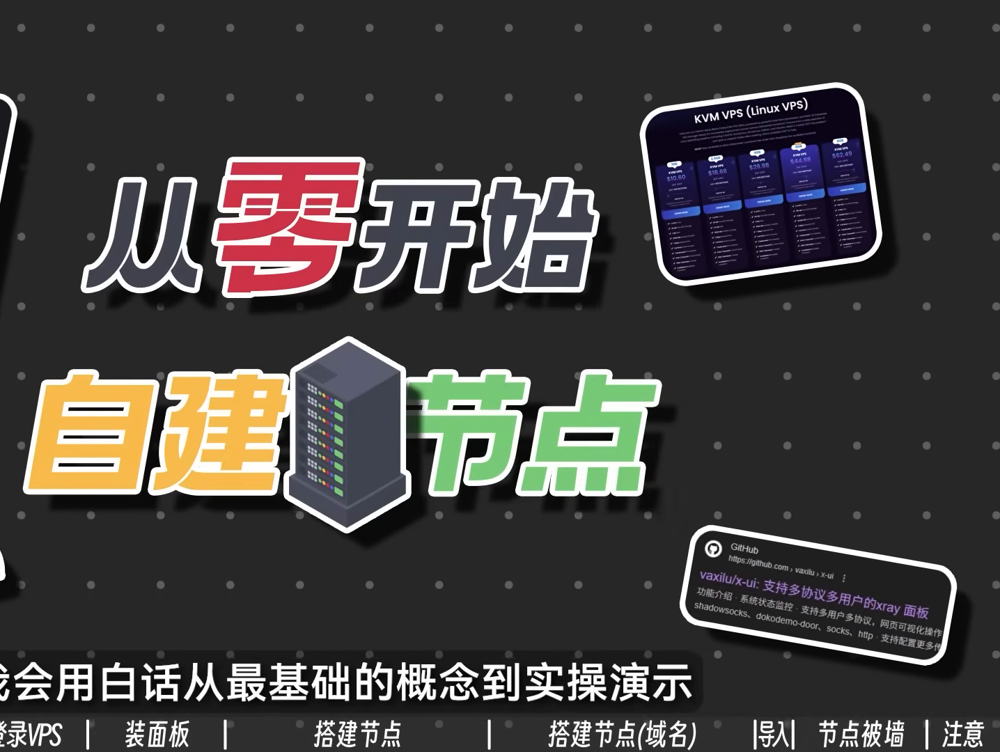
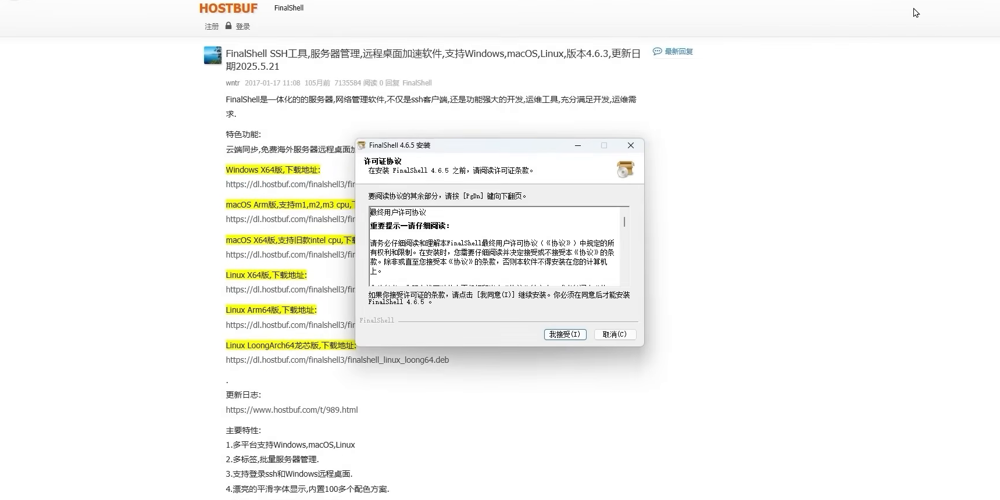

# 视频结构化总结

> 共 2 个章节

## 目录

1. 从零开始：翻墙原理与VPS购买配置 [00:00-09:30]
2. 节点搭建实战：X-UI面板配置与协议详解 [09:30-19:10]

---

---

## 从零开始：翻墙原理与VPS购买配置 [00:00-09:30]

### 时间线叙事

**[00:00-00:28] | 课程介绍与目标**
- 视频开篇指出常见痛点：VPN太贵用不起，机场不稳定会跑路。
- 本系列视频目标：教观众从零开始搭建属于自己的翻墙节点。
- 承诺用白话从最基础的概念到实操演示，一步步讲解如何设置以及为什么这样设置，保证从未接触过自建节点的观众也能一遍学会。

**[00:28-01:03] | 翻墙核心原理**
- 翻墙节点的基本原理：用国内的电脑连接一台国外的电脑，由国外电脑替我们浏览谷歌、油管等被墙网站。
- 这台国外电脑称为VPS（虚拟专用服务器）。
- 购买VPS后，在其上搭建一个加密通道（即节点），使国内设备能在不被防火墙（GFW）察觉的情况下传输数据。
- 给通道加密的称为加密协议，常见的有Shadowsocks、Vmess、Trojan等，统称为翻墙协议。

**[01:03-01:14] | 总体搭建流程**
- 完整流程分为六步：
  1. 购买一台海外VPS
  2. 远程连接这台VPS
  3. 给VPS安装翻墙面板
  4. 通过面板建立翻墙节点
  5. 使用国内设备连接节点
  6. 测试有网，成功自建节点

**[01:14-01:57] | VPS选购建议**
- 不同国家的VPS翻墙速度不同：大陆用户连接美国VPS通常比连接香港VPS慢，因为香港距离更近。
- 同一国家不同线路的VPS速度也有差异：例如美国洛杉矶的VPS，有的接入CN2 GIA高端线路（延迟最低130ms），有的接入普通线路（延迟230-330ms）。
- 一分钱一分货：线路好、流量多、速度快的VPS贵；线路差、流量少、速度慢的VPS便宜。
- 对新人建议：不推荐购买CN2 GIA高端VPS，可以先买个便宜功能齐全的VPS练手。

**[01:57-02:20] | 推荐VPS商家**
- 推荐RackNerd或CloudCone的美国洛杉矶VPS，每年不到20美元。
- 这两家是VPS论坛公认的价格低、流量大、功能全的入门级VPS。
- 视频是长期教程，如果商家涨价或功能阉割，会更换链接。

**[02:20-03:43] | 购买VPS实操演示**
- 以RackNerd为例，进入黑色星期五特卖活动页。
- 选择KVM VPS类型，这是最便宜的VPS种类，新人买这种即可。
- 示例配置：10.6美元/年，1G带宽，每月2T流量。
- 选择18.66美元的套餐，配置为2.5G内存、2核CPU，操作系统选择Ubuntu系统。
- 注意：VPS不是家用电脑，不用Windows系统，大部分是Linux发行版（Ubuntu、Debian、CentOS）。
- 选择VPS所在地区：在中国购买美国VPS，最好选择距离最近的美国西部地区（如洛杉矶机房），避免选择纽约等东部地区。
- 支付方式：PayPal、银行卡、USDT、银联、支付宝均可。

**[03:43-04:19] | 获取VPS登录信息**
- 支付完成后，在RackNerd后台可以看到VPS的IP地址、在线状态、每月流量等信息。
- 厂商会发送包含VPS登录信息的邮件，最重要的三行：IP地址、用户名、密码以及SSH端口（默认22）。
- 这封邮件需要保存好。

**[04:19-05:39] | 使用SSH登录VPS**
- 登录Linux系统需要使用SSH（Secure Shell），而不是Windows的远程桌面。
- 需要下载SSH软件，本视频使用对新手友好的FinalShell。
- 下载FinalShell后打开，点击上方文件图标，再点击白色文件图标，选择SSH连接。
- 填写VPS信息：
  - 名称：随便填写（备注用）
  - 主机：邮件里的IP地址
  - 端口：默认22
  - 方法：密码登录
  - 用户名：邮件里的用户名（通常是root）
  - 密码：邮件里的密码
- 勾选“启用EXEC智能加速”（可选可不选）。
- 点击确定后，弹出是否接受密钥的提示，点击“接受并保存”。
- 连接成功后，界面显示Ubuntu VPS的系统版本、IP地址、硬盘容量等信息。

**[05:39-06:45] | VPS系统介绍与准备**
- 上方显示VPS的各类信息（系统版本、IP地址、硬盘容量等）。
- 左侧界面显示VPS的内存、CPU、网络占用情况。
- 下方文件是VPS的根目录，类似于Windows的C盘。
- 建议新人使用Ubuntu系统，因为生态最大、兼容性最强。
- 首次登录VPS需要更新或安装一些软件，执行命令：
```bash
apt update -y && apt upgrade -y
```

**[06:45-07:14] | 安装3X-UI面板**
- 在输入框输入安装3X-UI面板的命令：
```bash
bash <(curl -Ls https://raw.githubusercontent.com/mhsanaei/3x-ui/master/install.sh)
```
- 回车后，系统询问是否给面板分配随机端口，回答Y（是）。
- 安装成功后，显示绿色文本的登录信息，包括账号、密码和登录路径。
- 系统随机分配了一个端口（示例中为53540），需要全部保存在记事本里。

**[07:14-07:48] | 面板管理与开启BBR**
- 在命令行输入`x-ui`回车，进入3X-UI面板后台管理界面。
- 可以查看面板的开启状态：目前状态为running（运行中），自动启动状态为yes。
- 需要开启BBR功能：输入23回车，再输入1回车。
- BBR是一种TCP拥塞控制算法，开启后能让节点网速更快。
- 显示“BBR has been enabled successfully”表示成功开启。

**[07:48-08:18] | 登录3X-UI面板**
- 打开浏览器，输入登录信息中的链接（示例：http://107.173.250.222:53540/4brg9KbXU6xgMEK9tr）。
- 输入账号和密码，成功进入3X-UI面板。
- 面板系统信息页显示运行时间、硬件信息、网络速度等。

**[08:18-09:10] | 节点配置原理讲解**
- 访问外网的流量要从电脑先进入海外VPS，添加入站就是给VPS开一个能让其他设备流量进入的通道。
- 协议用来给流量加密，不让GFW知道你在访问谷歌。
- 常见协议：Vless、Vmess、Shadowsocks，用什么协议搭建的节点就叫什么节点。
- 安全选项：目前只有Reality和TLS两个可选项，可以伪装成没被墙的合法网站，逃过GFW封锁。
- 上述三种选项（协议、传输、安全）需要合理搭配才能成功骗过防火墙访问外网。

**[09:10-09:30] | 创建第一个节点**
- 第一种推荐配置：VLESS + XHTTP + Reality节点。
- 备注随便填写（示例中填了test1）。
- 协议选择VLESS。
- 端口由系统随机分配（示例中为34283），每次创建节点分配的端口都不一样。

### 要点总结

本章从零开始讲解了翻墙的核心原理（国内设备连接海外VPS，通过加密通道传输数据），详细演示了VPS的选购、购买、SSH登录、面板安装和BBR加速开启的全过程，最后介绍了节点配置的基本概念。学习目标是让观众理解翻墙节点的工作原理，并能够独立完成VPS的购买和基础环境搭建。






---

## 节点搭建实战：X-UI面板配置与协议详解 [09:30-19:10]

### 时间线叙事

**[09:30-10:15] | 创建第一个节点：VLESS + XHTTP + Reality**
- 在X-UI面板的入站配置中，于“路径”字段填写正斜杠加随机数字字母（如`/abc123`），用于设置网络访问路径，其余选项保持默认。
- 向下滚动至“安全”选项，选择`Reality`协议。Reality是一种伪装成合法网站的协议，能绕过GFW封锁。
- 在Reality配置中，重点修改`target`和`SNI`字段：默认值为`google.com:443`和`google.com,www.google.com`，但为避免被GFW识别，建议改为不被封锁的合法网站，如微软官网或苹果官网。本教程填写`microsoft.com:443`和`microsoft.com,www.microsoft.com`。
- 点击`Get New Cert`按钮，系统自动生成公钥和私钥。
- 点击“创建”按钮，完成节点创建。该节点由VLESS协议加密、XHTTP协议传输、Reality协议伪装成微软官网。

**[10:15-10:35] | 导出节点配置**
- 在入站列表中，点击左侧的加号（+）图标，选择“二维码”选项。
- 使用V2Ray、小火箭（Shadowrocket）或Clash等客户端直接扫码添加节点；也可点击二维码图片自动复制订阅链接。

**[10:35-11:03] | 创建第二个节点：VLESS + TCP + Reality**
- 再次点击“添加入站”，备注填写“测试节点二”，协议选择`vless`，端口由系统随机分配一个新端口。
- 在“传输”选项中选择`TCP`，其余保持默认。
- “安全”继续选择`Reality`，将`target`和`SNI`同样改为`microsoft.com:443`和`microsoft.com,www.microsoft.com`。
- 点击`Get New Cert`生成公钥私钥，然后点击“创建”。第二个节点由VLESS协议加密、TCP协议传输、Reality协议伪装成微软官网。

**[11:03-11:45] | 配置客户端流量与到期时间**
- 在节点详情中，为客户端设置流量限制为300GB，到期日期填写`2025年12月31日`。
- 扫描该节点二维码的用户将获得一个2025年12月31日到期的300G流量节点。
- 一台VPS可以搭建无数个节点，这些节点共用VPS的流量和带宽。用户越多，流量消耗越快，带宽越拥挤，网速越慢；仅一人使用时则为独享。

**[11:45-12:15] | 使用域名的好处与准备工作**
- 使用域名搭建节点有以下好处：避免VPS的IP地址泄露；可以搭建更多种类的节点；可以使用域名套CDN，为性能较差的VPS提高网速。
- 需要准备一个免费或低价域名，并确保域名已托管进Cloudflare。若不清楚托管流程，可参考频道相关教程。

**[12:15-13:07] | 添加DNS解析记录**
- 在Cloudflare控制台，点击已托管的域名（如`inficheesylink.top`），进入DNS设置。
- 点击“添加记录”，类型选择`A`，名称填写随意字母数字（如`test`），IPv4地址填写VPS的IP地址，代理状态关闭（仅DNS），TTL保持自动。
- 点击“保存”，等待约5分钟解析生效。
- 打开CMD命令行，执行`ping test.inficheesylink.top`，若返回VPS的IP地址（如`107.173.250.222`），说明解析成功。

**[13:07-14:24] | 安装SSL证书**
- 回到VPS终端，通过X-UI面板的SSL管理功能安装证书。输入`18`选择“SSL Certificate Management”。
- 选择`1`开始自动申请证书，填写自己的域名（如`test.inficheesylink.top`），端口选择默认的80端口。
- 询问是否使用ACME脚本时，选择`N`（不影响VPS）。
- 询问是否对面板设置证书时，选择`yes`。
- 看到绿色文字提示即表示SSL证书申请成功。证书保存路径为：
  - 公钥：`/root/cert/test.inficheesylink.top/fullchain.pem`
  - 私钥：`/root/cert/test.inficheesylink.top/privkey.pem`
- 最关键的是`Access URL`行，例如`https://test.inficheesylink.top:53540/4brg9KbXU6xgMEK9tr/`，以后可通过域名登录X-UI面板，账号密码不变。

**[14:24-15:41] | 创建第三个节点：VMess + WebSocket + TLS**
- 通过域名进入X-UI面板，之前搭建的两个节点（VLESS+XHTTP+Reality和VLESS+TCP+Reality）均由Reality协议伪装。
- 现在选择另一个安全模块——TLS协议。TLS可以伪装成自己域名的小网站，因为新域名未被GFW拉黑，伪装更安全。
- 最常见的TLS节点协议搭配是VMess+WS+TLS。
- 点击“添加入站”，备注填写“测试节点三”，协议选择`vmess`，传输选择`WebSocket`（简称WS），主机填写自己的域名（如`test.inficheesylink.top`），路径填写随意字母数字（如`/ngiwadng`），其余保持默认。
- “安全”选择`TLS`，SNI填写自己的域名，公钥和私钥点击“从面板设置证书”，系统自动读取域名的SSL证书。
- 点击“创建”，完成节点搭建。该节点由VMess协议加密、WebSocket协议传输、TLS协议伪装成自己的网站。
- 注意：使用TLS节点时，建议将端口改为常用端口（如443、2083、2096、2087、8443等），而非随机端口。本教程将端口改为443。

**[15:41-16:14] | 客户端推荐**
- 对于机场节点，推荐使用Clash Verge或其他Clash变体。但新协议（如XHTTP）可能不被部分客户端支持。
- 各平台推荐客户端：
  - Windows：V2rayN
  - macOS/iOS：Shadowrocket（小火箭）
  - Android：V2rayNG或SinBox

**[16:14-17:02] | 节点被墙的原因与解决方法**
- 节点被墙的常见表现：VPS流量剩余、SSH可连接、Xray核心运行正常，但客户端连接节点后无法访问谷歌、YouTube等网站。
- 被墙原因：加密协议中存在微小特征，或伪装流量与正常访问流量存在差异，被GFW捕捉并阻断。可能阻断端口（换端口即可），也可能直接封掉VPS的IP。
- 解决方法：
  1. 花3-5美元给VPS更换IP地址（价格因厂商而异）。
  2. 使用域名搭建节点，并通过Cloudflare给域名套CDN，利用Cloudflare的官方节点IP绕过GFW，成本仅几块钱。

**[17:02-18:09] | 加密协议与GFW的军备竞赛**
- 加密协议发展史：从早期的SS（Shadowsocks）被GFW精准识别，到后来的Vmess、Vless、Trojan、Hysteria等协议不断推出更新，GFW也进化出各种识别方法。
- 加密协议与GFW就像军备竞赛，随着时代发展不断迭代升级。
- 从普通机场或一键式VPN用户转向自建节点时，需要站在与GFW对抗的网络工程师角度思考问题，而非抱怨机场。新GFW需要新技术来突破，这是一条需要不断学习的路线。

**[18:09-19:10] | 安全建议与后续教程预告**
- SNI选择建议：教程中直接选择Microsoft、Apple等热门网站伪装，实际上并不推荐。热门网站的流量特征固定，伪装后可能被GFW识破。建议选择地理区位靠近VPS的小众网站，伪装更真实。
- SSH安全建议：默认22端口易被黑客扫描攻击，建议将SSH登录端口切换到其他高位端口。
- 以上问题的原理和解决方法，频道后续会单独出视频讲解，链接将放在YouTube视频简介。
- 视频简介中还有频道推荐的IEPL专线机场和低价北美VPS信息。

### 要点总结

本章详细演示了在X-UI面板中搭建三种常见翻墙节点的完整流程：VLESS+XHTTP+Reality、VLESS+TCP+Reality、VMess+WebSocket+TLS，涵盖从无域名到有域名的配置方法、SSL证书安装、DNS解析设置以及客户端推荐。同时深入分析了节点被墙的原因（加密特征与流量差异）和应对策略（更换IP或套CDN），并强调了SNI选择与SSH端口安全等进阶注意事项，帮助用户从消费者思维转向网络工程师思维，持续对抗GFW的封锁。


