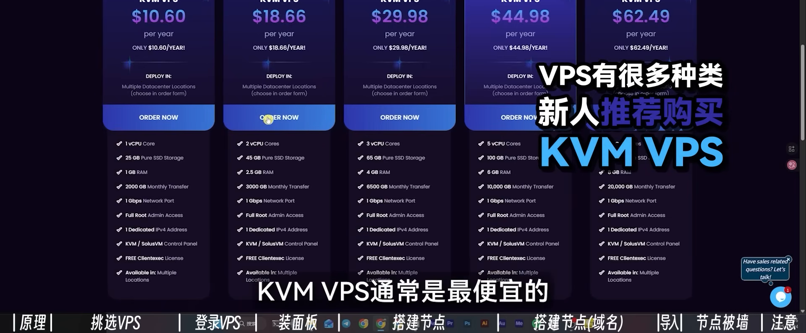
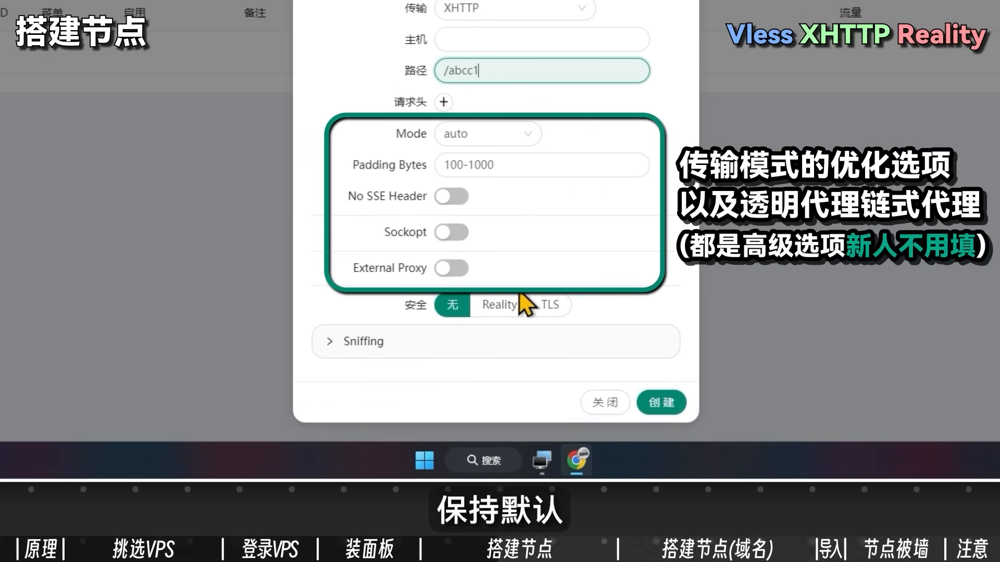
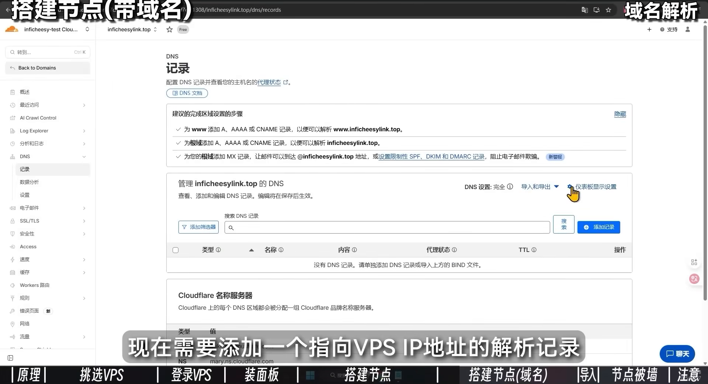
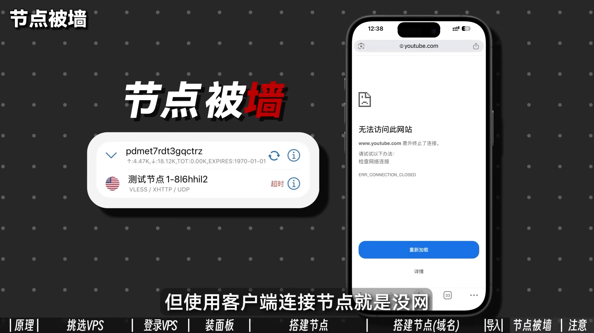

# 视频结构化总结

> 共 2 个章节

## 目录

1. 自建翻墙节点原理与基础介绍 [00:00-09:30]
2. reality协议伪装参数配置 [09:30-19:10]

---

---

## 自建翻墙节点原理与基础介绍 [00:00-09:30]

### 时间线叙事

**[00:00-00:28] | 课程目标与受众定位**
- 视频开篇指出常见痛点：商业VPN价格昂贵，机场服务不稳定且可能跑路。
- 本系列视频目标：从零开始教观众搭建属于自己的翻墙节点。
- 承诺用白话讲解基础概念（VPS、面板、协议、域名），即使零基础也能学会。
- 强调会从概念到实操演示，一步步讲解设置方法及原理。

**[00:28-01:03] | 翻墙节点核心原理**
- 原理：国内电脑连接一台国外电脑，由国外电脑代为访问谷歌、YouTube等被墙网站。
- 这台国外电脑称为VPS（虚拟专用服务器）。
- VPS价格：普通美国VPS按时间/流量计费，每年10-30美元，每月提供1-6T流量。
- 加密通道（节点）：在VPS上搭建加密通道，使国内设备在不被防火墙（GFW）察觉的情况下传输数据。
- 加密协议：用于给通道加密，常见协议包括Shadowsocks、Vmess、Trojan等，统称为翻墙协议。

**[01:03-01:14] | 自建节点总体流程**
- 总体步骤：购买海外VPS → 远程连接VPS → 安装翻墙面板 → 通过面板建立翻墙节点 → 国内设备连接节点 → 测试访问外网成功。

**[01:14-01:57] | VPS选购原则与推荐**
- 国家选择：想搭建哪个国家的节点就买哪个国家的VPS。
- 速度差异：大陆用户连接美国VPS通常比连接香港VPS慢（距离更近）。
- 线路差异：同一国家不同线路速度不同。例如美国洛杉矶VPS，接入CN2 GIA高端线路延迟可低至130ms，普通线路延迟可能230-330ms。
- 价格规律：一分钱一分货，线路好、流量多、速度快的VPS贵，反之便宜。
- 新人建议：不推荐购买CN2 GIA高端VPS，建议先买便宜功能齐全的VPS练手。
- 推荐商家：RackNerd或CloudCone的美国洛杉矶VPS，每年不到20美元，是公认价格低、流量大、功能全的入门级VPS。

**[01:57-02:20] | 购买VPS流程（以RackNerd为例）**
- 打开RackNerd官网，进入黑色星期五特卖活动页。
- 选择KVM VPS类型（最便宜，适合新人）。
- 示例价格：10.6美元/年，1G带宽，每月2T流量。
- 说明：黑五/圣诞等节日会有低价活动，非活动期厂商也会偶尔推出其他低价VPS。

**[02:20-03:14] | 订单配置详解**
- 选择18.66美元的套餐。
- 订单包含：VPS配置、公网IP地址、主机名（类似Windows电脑名称）。
- 额外IPv4选项：一台VPS只需一个IP地址，选择None。
- 配置参数：2.5G内存、2核CPU、Ubuntu系统。
- 系统说明：VPS通常使用Linux发行版（Ubuntu、Debian、CentOS），而非Windows系统。
- 地区选择：在中国购买美国VPS，应选择距离最近的美国西部地区（如洛杉矶），避免选择纽约等东部地区。

**[03:14-04:02] | 完成购买与获取登录信息**
- 选择洛杉矶机房后点击继续，进入结账页面。
- 支付方式：PayPal、银行卡、USDT、银联、支付宝等。
- 点击完成订购，支付发票。
- 支付完成后，VPS显示在线状态，每月3T流量。
- 厂商会发送包含登录信息的邮件，关键信息：IP地址、用户名（root）、密码、SSH端口（22）。

**[04:02-04:42] | SSH连接工具介绍**
- Linux系统登录需使用SSH（Secure Shell），而非Windows远程桌面。
- SSH软件推荐：FinalShell（对新手友好）。
- 下载：打开FinalShell官网，Windows用户点击对应链接下载。

**[04:42-05:39] | 使用FinalShell连接VPS**
- 打开FinalShell，点击上方文件图标 → 白色文件图标 → 选择SSH连接。
- 填写连接信息：
  - 名称：任意备注
  - 主机：邮件中的IP地址
  - 端口：默认22
  - 方法：密码登录
  - 用户名：root
  - 密码：邮件中的密码
- 勾选“启用EXEC”（智能加速，可选）。
- 点击确定，连接主机。
- 弹出密钥确认窗口（建立信任关系），点击“接受并保存”。

**[05:39-06:00] | 连接成功后的界面**
- 连接成功显示VPS系统信息：系统版本（Ubuntu）、IP地址、硬盘容量等。
- 命令行提示符：`root@主机名:~#`，是输入命令的地方。
- 左侧界面显示VPS的内存、CPU、网络占用等信息。
- 下方文件列表为VPS根目录，类似Windows的C盘。

**[06:00-06:45] | 安装翻墙面板（3X-UI）**
- 建议新人使用Ubuntu系统（生态大、兼容性强），熟悉其他Linux发行版可选用Debian（资源占用更低）。
- 首次登录需更新软件包，执行命令：
  ```bash
  apt update -y && apt upgrade -y
  ```
- 安装3X-UI面板的命令：
  ```bash
  bash <(curl -Ls https://raw.githubusercontent.com/mhsanaei/3x-ui/master/install.sh)
  ```

**[06:45-07:14] | 面板安装过程**
- 执行安装命令后，询问是否给面板分配随机端口，输入Y（是）或N（否），选择Y。
- 安装成功显示绿色登录信息：
  - Username: THfuLRCLWW
  - Password: Gbb9DrImgR
  - Port: 53540
  - WebBasePath: 4brg9KbXU6xgMEK9tr
  - Access URL: http://107.173.250.222:53540/4brg9KbXU6xgMEK9tr
- 将所有信息保存到记事本。

**[07:14-07:48] | 面板管理与开启BBR加速**
- 在命令行输入`x-ui`回车，进入面板后台管理界面。
- 查看面板状态：running（运行中），自动启动状态：yes。
- 开启BBR功能：输入23回车 → 输入1回车 → 显示“BBR has been enabled successfully”。
- BBR说明：TCP拥塞控制算法，开启后能让节点网速更快，新人无需理解原理。

**[07:48-08:18] | 登录3X-UI面板**
- 打开浏览器，输入Access URL链接：`http://107.173.250.222:53540/4brg9KbXU6xgMEK9tr`
- 输入用户名和密码登录。
- 进入面板系统信息页，显示运行时间、硬件信息、网络速度等。

**[08:18-09:10] | 创建节点（添加入站）**
- 概念说明：访问外网的流量从国内电脑进入海外VPS，“添加入站”就是给VPS开一个能让其他设备流量进入的通道。
- 协议：用于给流量加密，不让GFW知道你在访问谷歌。常见协议：Vless、Vmess、Shadowsocks。
- 安全选项：Reality和TLS，可伪装成没被墙的合法网站，逃过GFW封锁。
- 三种选项合理搭配即可成功骗过防火墙访问外网。

**[09:10-09:30] | 节点配置示例**
- 第一种推荐配置：VLESS + XHTTP + Reality节点。
- 备注：随便填写（如test1）。
- 协议选择：Vless。
- 端口：随机分配（如34283），每次创建节点分配的端口不同。

### 要点总结

本章从零开始讲解了自建翻墙节点的完整原理和基础操作流程，包括：翻墙原理（国内设备通过海外VPS访问外网）、VPS选购原则（推荐RackNerd/CloudCone美国洛杉矶入门级VPS，每年约10-30美元）、使用FinalShell通过SSH连接VPS、安装3X-UI翻墙面板、开启BBR加速，以及面板中创建节点的基本概念（协议、安全、端口配置）。学习目标是让零基础观众理解自建节点的核心逻辑，并能够独立完成VPS购买、SSH连接和面板安装。





---

## reality协议伪装参数配置 [09:30-19:10]

### 时间线叙事

**[09:30-09:46] | 配置Reality协议伪装参数**
- 在xhttp路径填写正斜杠加随机数字字母，用于设置网络访问路径，保持默认设置向下滚动
- 安全选项选择Reality，这是一个伪装合法网站的协议
- 弹出多个配置项，只需留意target和SNI字段，需要填写不被GFW封锁的合法网站
- 不能填写默认的google.com，建议改成微软官网或苹果官网，填写microsoft.com

**[09:46-10:15] | 生成密钥并创建节点**
- 点击Get New Cert按钮，自动生成了公钥和私钥
- 点击创建按钮完成节点创建
- 创建完成：由Vless协议加密、XHTTP协议传输、Reality协议伪装成微软官方的翻墙节点

**[10:15-10:35] | 导出节点二维码**
- 点击左侧加号，点击二维码选项
- 使用V2Ray小火箭或Clash直接扫码添加节点
- 也可以点击二维码图片自动复制订阅链接

**[10:35-11:03] | 搭建第二个节点（Vless+TCP+Reality）**
- 再次点击添加入站，备注填写“测试节点二”
- 协议选择vless，端口随机分配新端口
- 传输选择tcp，其他保持默认
- 安全继续选择Reality，target和SNI改为microsoft.com
- 点击get new cert创建公钥私钥，点击创建
- 完成第二个节点：Vless协议加密、TCP协议传输、Reality协议伪装成微软官网

**[11:03-11:30] | 配置客户端流量和到期时间**
- 设置300G流量，到期日期填写2025年12月31日
- 扫描二维码的用户将获得2025年12月31日到期的300G流量洛杉矶节点
- 一台VPS可以搭建无数个节点，共用流量和带宽
- 越多人用流量掉得越快，带宽越拥挤，网速越慢；只有一个人使用就是独享

**[11:45-12:15] | 使用域名的好处及准备工作**
- 使用域名的好处：避免VPS的IP地址泄露、搭建更多种类节点、使用域名套CDN提高垃圾VPS网速
- 需要免费或低价域名，可参考相关教程
- 首先准备一个域名，确保域名已托管进Cloudflare
- 如果不明白托管，可查看详细科普教程

**[12:15-12:30] | 添加DNS解析记录**
- 在Cloudflare上托管好的域名（infrastructure link dot top），点击域名，点击DNS
- 添加指向VPS IP地址的解析记录：类型选择A记录，名称随意字母数字（如test），IPV4填写VPS的IP地址
- 代理状态关闭，点击保存，等待五分钟解析生效

**[12:30-13:00] | 验证DNS解析**
- 打开CMD命令行，ping刚才设置的域名（名称+域名的组合，如test.infrastructure link.top）
- 看到有回应，显示VPS的IP地址，说明解析成功

**[13:00-13:27] | 安装SSL证书**
- 回到VPS，通过三叉UI面板安装SSL证书
- SSL证书涉及HTTPS加密，可以把域名绑定在VPS上，搭建更多不同协议节点，让节点和VPS更安全
- 输入18，选择三叉UI的SSL管理

**[13:27-14:06] | 申请SSL证书**
- 选择1回车，开始自动申请证书
- 填写自己的域名，回车
- 选择端口，默认80端口，回车
- 询问是否要ACME脚本，选择N回车
- 询问是否对面板设置证书，选择yes回车
- 看到绿字说明SSL证书申请成功，显示证书在VPS里的保存路径
- 最关键的是Access URL行，以后可以用域名登录三叉UI面板，保存到记事本

**[14:06-14:35] | 通过域名登录面板**
- 通过域名进入三叉UI面板，账号和密码不变

**[14:35-14:57] | 搭建TLS节点**
- 之前搭建的两个节点（vless+xhttp+reality和vless+tcp+reality）都由reality协议伪装
- reality协议可伪装成微软苹果等国际大厂合法网站
- 现在选择另一个安全模块TLS协议，TLS可伪装成自己域名的小网站
- 因为新域名GFW没拉黑，伪装成它就不会被墙
- 搭建TLS节点最常见的协议搭配是Vmess+WS+TLS

**[14:57-15:33] | 配置Vmess+WS+TLS节点**
- 名称：测试节点三
- 传输选择WebSocket（简称WS）
- 主机填写自己的域名：test.internet link.top
- 路径随意字母搭配，其他保持默认
- 安全选择TLS，SNI填写自己的域名
- 公钥和私钥点击“从面板设置证书”，自动读取域名的SSL证书
- 创建完成：Vmess协议加密、WebSocket协议传输、TLS协议伪装成自己网站的翻墙节点

**[15:33-15:56] | 修改TLS节点端口**
- 使用TLS节点一般建议端口：443、2083、2096、2087、9300、8443
- 刚才用的是随机端口，现在改成443

**[15:56-16:14] | 推荐客户端软件**
- 机场节点推荐Clash Verge或其他Clash变体
- 新代理协议（如流行的XHTTP）更新较慢，部分Clash变体或小众代理软件不支持新协议
- Windows推荐V2rayN，MacOS/iOS推荐Shadowrocket（小火箭），安卓推荐V2rayNG或SinBox

**[16:14-16:41] | 节点被墙的原因及解决方法**
- 节点被墙：VPS流量还剩很多，SSH可连接VPS面板，Xray核心运行正常，但客户端连接节点没网
- 解决方法：花3-5美元给VPS更换IP地址（价格因厂商而异），或按教程用域名搭建节点，通过Cloudflare套CDN绕过GFW，成本仅几块钱

**[16:41-17:25] | 被墙的深层原因**
- 被墙原因复杂，并非破解加密协议发现访问谷歌
- 加密协议中有微小特征，或伪装苹果官网的流量与正常访问流量有差异，被GFW捕捉
- GFW可能阻断端口（给节点换端口即可），或直接封掉VPS的IP
- 加密协议发展史：SS横空出世后被GFW精准识别，Vmess、Vless、Trojan、Hysteria等协议不断推出更新，GFW也进化出各种识别方法

**[17:25-17:53] | 加密协议与GFW的军备竞赛**
- 加密协议和GFW像军备竞赛，随时代发展不断迭代升级
- 从普通机场或一键式VPN用户转移到自建节点方向，不能再像以前那样节点不行就骂机场
- 需要站在与GFW对抗的网络工程师角度思考问题

**[17:53-18:24] | 需要不断学习的技术路线**
- GFW对我做了什么？新GFW需要新技术来突破，这是一条需要不断学习的路线
- SNI的选择：教程直接选Microsoft、Apple等热门网站伪装，实际上并不推荐
- 热门网站的流量特征非常固定，伪装它们翻墙可能被GFW识破
- 建议选择地理区位靠近VPS的小众网站，伪装更真实

**[18:24-18:58] | SSH端口安全问题**
- SSH登录默认都是22端口
- 全球VPS都默认22端口，黑客会专门扫描22端口并尝试攻击
- 建议把SSH登录端口切换到其他高位端口

**[18:58-19:10] | 后续教程预告**
- 这些问题产生的原理和方法，频道以后会单独出视频讲解
- 链接放在YouTube视频简介
- 视频简介里有频道推荐的IEPL专线机场和低价北美VPS

### 要点总结

本章详细讲解了Reality协议伪装参数的配置方法，包括将target和SNI设置为微软官网等合法网站、生成公钥私钥、创建Vless+XHTTP+Reality和Vless+TCP+Reality两种节点。随后介绍了使用域名搭建节点的完整流程：域名托管到Cloudflare、添加A记录解析、安装SSL证书、通过域名登录面板。最后讲解了TLS节点的搭建方法（Vmess+WS+TLS）、节点被墙的原因及解决方法、SNI选择建议（推荐小众网站）、SSH端口安全等进阶知识。





