# 视频结构化总结

> 共 6 个章节

## 目录

1. Introduction and Course Review [00:00-02:04]
2. GPU Architecture Review: Memory Hierarchy and Thread Organization [02:04-06:57]
3. Resource Utilization, Occupancy, and Memory Access Patterns [06:57-13:15]
4. Introduction to Convolution: 1D and 2D Concepts [13:15-31:50]
5. 2D Convolution CUDA Implementation: Basic Kernel [31:50-47:36]
6. Optimization: Tiling for Data Reuse in Convolution [47:36-66:01]

---

---

## Introduction and Course Review [00:00-02:04]

### 时间线叙事

**[00:00-00:14] | 课程开场与主题引入**
- 讲师欢迎学生进入GPU计算系列讲座第八讲，宣布今天开始讨论并行模式（parallel patterns），第一个要介绍的并行模式是卷积（convolution）。
- 在进入新主题前，讲师决定先回顾之前课程已覆盖的内容，因为前几讲已经讲授了GPU计算的基础知识。

**[00:14-00:29] | 回顾目的说明**
- 讲师说明在过渡到并行模式这一新部分之前，需要进行一次快速回顾（quick review），以巩固学生对GPU计算基本原理的理解。

**[00:29-00:47] | 处理器趋势与并行计算兴起**
- 展示“Processor Trends”图表，横轴为1970年至2020年，纵轴包含晶体管数量（千）、单线程性能（SpecINT x10^4）、频率（MHz）、典型功耗（Watts）和逻辑核心数量。
- 讲师指出课程初期探讨了单线程性能（thread performance）如何因功耗墙（power wall）导致频率停滞（frequency stagnated），这一现状促使计算领域向并行计算方向发展。

**[00:47-01:00] | CPU与GPU设计对比：延迟导向 vs 吞吐量导向**
- 展示“Approaches to Processor Design”幻灯片，左侧为CPU（延迟导向设计），右侧为GPU（吞吐量导向设计）。
- CPU设计特点：拥有少量强大的ALU（算术逻辑单元），减少操作延迟；配备大型缓存，将长延迟内存访问转换为短延迟缓存访问；采用复杂的控制逻辑，包括分支预测（减少控制冒险）和数据转发（减少数据冒险），以最小化流水线停顿。
- GPU设计特点：拥有许多小型ALU，单个操作延迟较长但吞吐量高，且高度流水线化以进一步提升吞吐量；缓存较小，将更多芯片面积用于计算；控制逻辑简单，将更多面积用于计算。

**[01:00-01:28] | 延迟隐藏机制对比**
- CPU通过少量多线程（modest multitasking）来隐藏其他技术未能覆盖的剩余延迟，但多线程程度有限以最小化数据开销。
- GPU则通过大量线程（massive number of threads）来补偿操作的高延迟，利用线程切换隐藏内存访问延迟，从而实现高吞吐量。

**[01:28-02:04] | 系统架构回顾**
- 展示“Memory Management”幻灯片，说明典型系统中GPU与CPU的协同工作方式。
- 流程步骤：①在GPU上分配GPU内存；②将数据从CPU主内存复制到GPU内存；③在GPU上执行计算；④将结果从GPU内存复制回CPU主内存；⑤CPU主内存与GPU内存之间的数据驱动。
- 讲师强调系统中存在带有主内存的CPU，GPU通过PCIe等总线与CPU连接，数据需要在两者之间传输。

### 要点总结

本章作为第八讲的引入部分，首先宣布新主题为并行模式中的卷积，随后系统回顾了GPU计算的基础知识：从处理器趋势（频率停滞导致并行计算兴起）出发，对比了CPU的延迟导向设计与GPU的吞吐量导向设计在ALU、缓存、控制逻辑和延迟隐藏机制上的根本差异，最后回顾了GPU与CPU在系统中的协作架构及数据管理流程。


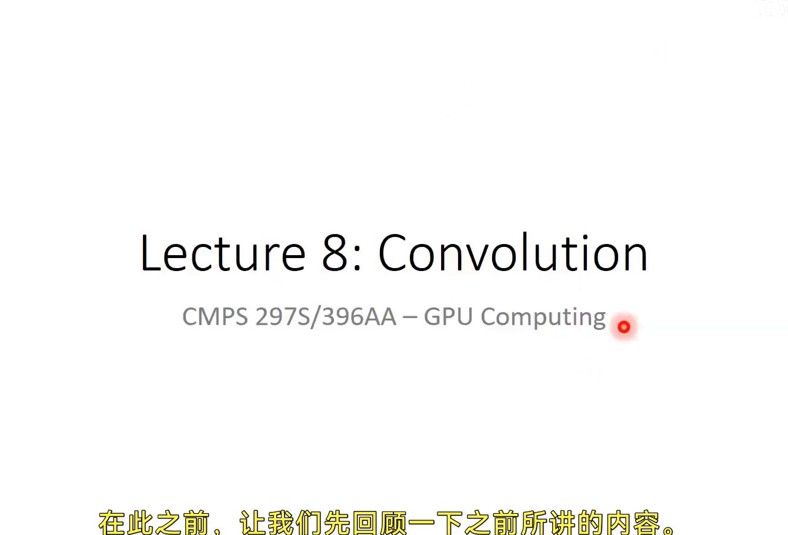
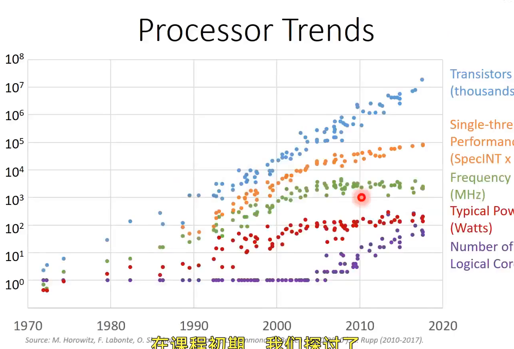
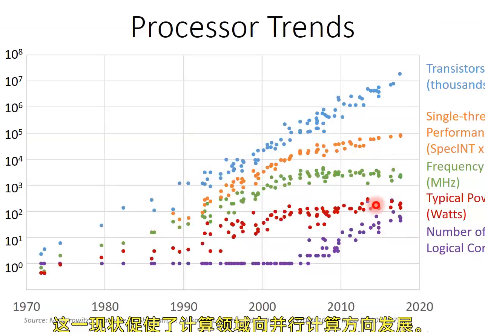
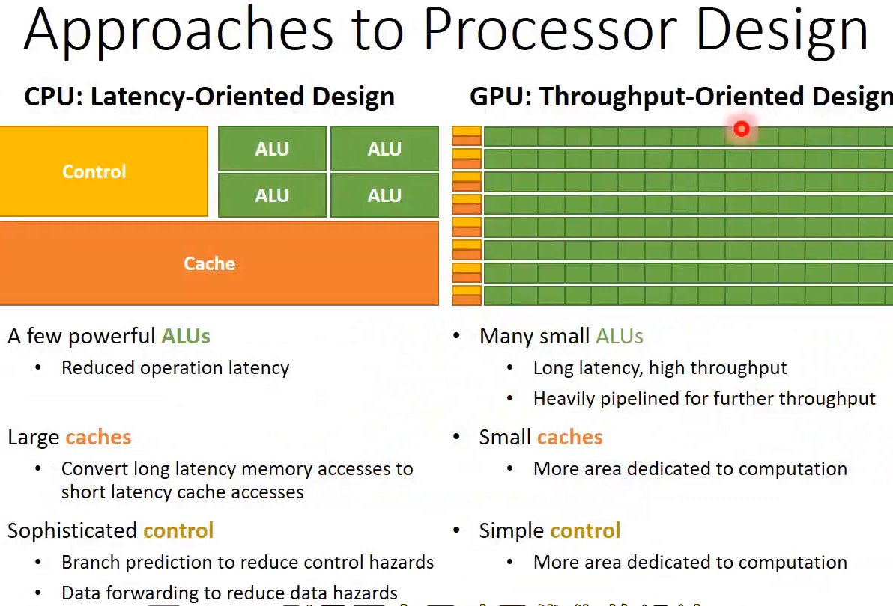


---

## GPU Architecture Review: Memory Hierarchy and Thread Organization [02:04-06:57]

### 时间线叙事

**[02:04-02:28] | GPU内存管理基本流程**
- 典型GPU使用方式：CPU拥有主内存（Main Memory），GPU拥有自己的设备内存（Device Memory）
- 标准操作流程：
  1. 在GPU上分配内存（Allocate GPU memory）
  2. 将数据从CPU主内存复制到GPU内存（Copy data to GPU memory）
  3. 在GPU上执行内核（Execute kernel on GPU），同时访问GPU内存中的数据
  4. 将结果从GPU内存复制回CPU主内存（Copy data back）
  5. 释放GPU内存（Deallocate GPU memory）
- 此外还存在统一内存（Unified Memory）等其他方式，可在CPU上分配数据后在GPU上直接使用

**[02:41-03:08] | 数据并行性与向量加法回顾**
- 从简单的向量加法内核（vector addition kernel）开始，展示了数据并行性（data parallelism）概念
- 数据并行性是GPU的典型适用场景，向量加法被称为数据并行性的"Hello World"
- 网格（grid）组织为线程（threads）和块（blocks），通过计算线程索引来执行操作：
```cuda
int i = blockDim.x * blockIdx.x + threadIdx.x;
```
- 每个线程使用相同操作处理不同数据片段

**[03:08-03:44] | 多维网格与数据布局**
- 网格可组织为多维数组：二维网格（2D grids）和三维网格（3D grids）
- 内置维度变量包含x、y、z三个分量：gridDim.y、gridDim.z等
- 多维数据在内存中的布局采用行优先顺序（row-major order）
- 访问多维数据时需进行索引计算，将二维索引转换为一维索引以访问动态数组：
  - 逻辑视图：二维表格（如4x4矩阵）
  - 实际内存布局：一维连续数组（按行排列）

**[03:44-03:58] | 多维数据访问示例**
- RGB到灰度转换（RGB to grayscale conversion）
- 图像模糊（image blur），这是卷积（convolution）的特例
- 矩阵乘法（matrix-matrix multiplication），该示例将在后续课程中持续使用

**[04:08-04:38] | GPU架构与SM组织**
- GPU由多个流多处理器（Streaming Multiprocessors, SMs）组成
- 每个SM包含多个核心（cores），共享控制单元和内存
- 所有SM可访问同一全局内存（global memory）
- 例如Volta V100 GPU：80个SM，每个SM有64个核心，总计5120个核心
- 网格调度到SM时，以块（block）为粒度进行分配（block-aware parallelism）
- 同一块中的所有线程在同一个SM上同时运行
- 一个SM上可同时运行多个线程块

**[04:38-05:08] | Warp调度与SIMD执行**
- 当块被调度到SM后，进一步划分为warp（线程束）
- Warp是SM中的调度单元（unit of scheduling）
- Warp大小因设备而异，但至今一直是32个线程
- 同一warp中的线程按照SIMD模型执行：所有线程执行相同指令，处理不同数据
- 注意：warp大小可能在未来改变，不应假设永远为32

**[05:08-05:57] | 控制分歧（Control Divergence）**
- 同一warp中的线程若需走不同控制路径，则产生控制分歧
- 示例：条件语句`if(threadIdx.x < 24) { A } else { B }`
- 执行机制：
  1. 所有线程先执行then部分（threadIdx.x < 24的线程活跃，其余不活跃）
  2. 然后所有线程执行else部分（threadIdx.x >= 24的线程活跃，其余不活跃）
- 不活跃线程占用核心但不执行任何操作，导致硬件利用率不足（underutilization）
- 应尽量减少控制分歧，后续将讨论相关优化模式

**[06:01-06:38] | 延迟隐藏（Latency Hiding）**
- 通过在SM上调度比核心数量更多的warp和线程，实现线程超额订阅（oversubscription）
- 当某个warp遇到长延迟操作（long-latency operation）时：
  1. 将该warp移除
  2. 调度另一个准备好的warp执行
  3. 持续切换新warp，直到原warp完成长延迟操作
- 通过这种方式隐藏延迟，提高硬件利用率

**[06:38-06:57] | 占用率（Occupancy）约束**
- 占用率（occupancy）概念：每个SM上可调度的最大线程数
- 不同设备的占用率限制不同，例如V100为2048个线程/SM
- 其他约束因素：
  - 每个SM允许的最大块数（Max blocks per SM）
  - 每个线程使用的寄存器数量
  - 共享内存容量
- 示例设备参数表：

| 参数 | K40 | M40 | P100 | V100 |
|------|-----|-----|------|------|
| 微架构 | Kepler | Maxwell | Pascal | Volta |
| 计算能力 | 3.5 | 5.2 | 6.0 | 7.0 |
| SM数量 | 15 | 24 | 56 | 80 |
| 每SM核心数 | 192 | 128 | 64 | 64 |
| 每SM最大线程数 | 2048 | 2048 | 2048 | 2048 |
| 每SM最大块数 | 16 | 32 | 32 | 32 |
| 每块最大线程数 | 1024 | 1024 | 1024 | 1024 |
| 每SM寄存器数 | 64K | 64K | 64K | 64K |

### 要点总结

本章回顾了GPU架构中的内存层次结构（CPU主存与GPU显存的数据传输流程）和线程组织方式（网格-块-warp三级层次结构）。核心内容包括：多维网格索引计算与行优先数据布局、SM架构与块感知并行调度、warp的SIMD执行模型及其导致的控制分歧问题、通过线程超额订阅实现延迟隐藏的机制，以及影响占用率的各种硬件约束参数。


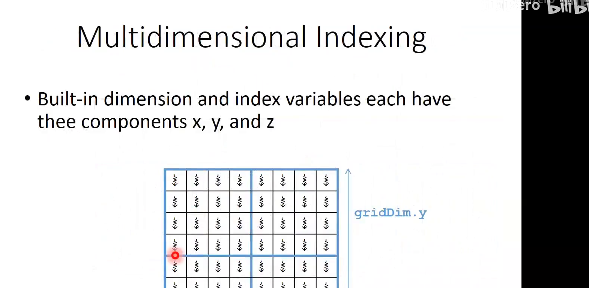
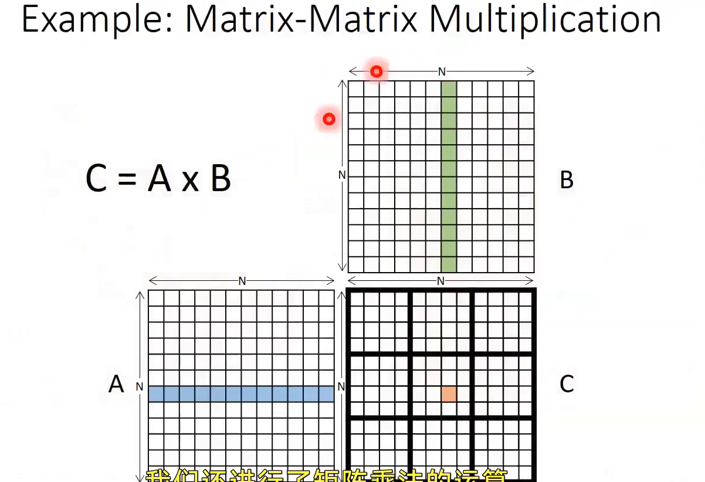
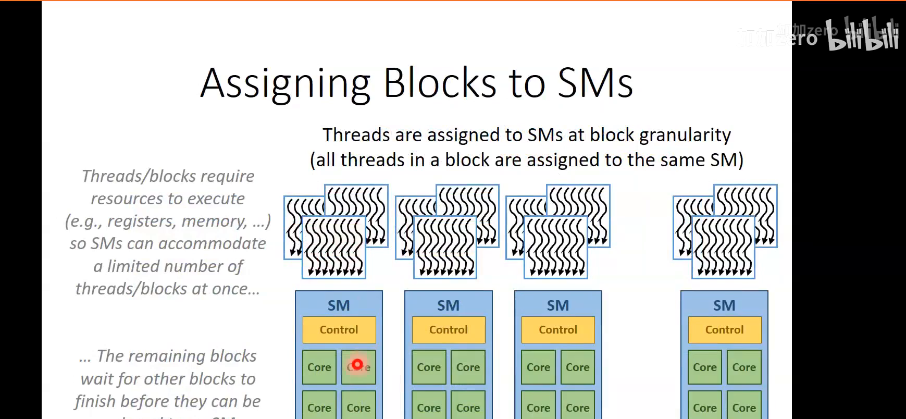
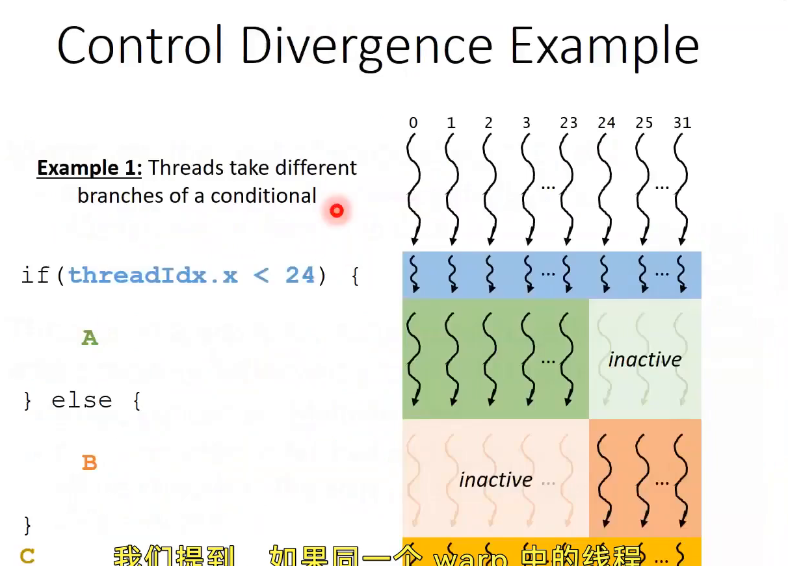


---

## Resource Utilization, Occupancy, and Memory Access Patterns [06:57-13:15]

### 时间线叙事

**[06:57-07:10] | 资源利用与占用率回顾**
- 回顾了每个SM的资源约束：每个线程拥有的寄存器数量、SM拥有的共享内存容量，以及每个SM能容纳的最大线程块数
- 强调了解资源利用率的重要性，目的是确保最大化SM上的线程数量（即高占用率）
- 关键参数示例：Kepler架构最大每SM线程数2048，最大每SM块数16，最大每SM寄存器数32K；Maxwell架构最大每SM寄存器数64K

**[07:10-07:30] | GPU架构中的共享内存**
- 展示了GPU架构中SM的内部结构：包含Control单元、Registers、SP（流处理器）、Constant Cache和Shared Memory/L1 Cache
- 同一SM上的线程可以访问该SM的共享内存，不同SM之间共享L2 Cache
- 共享内存的用途：将计划重复使用的数据放入共享内存，供同一块内的所有线程协作访问

**[07:30-08:20] | 分块矩阵乘法（Tiled Matrix Multiplication）示例**
- 背景：传统方法中每个线程需要加载A矩阵的整行和B矩阵的整列，导致大量全局内存访问
- 优化方法：同一块内的线程协作加载A和B的分块（tile）到共享内存
  - Step 1：每个线程只加载分块中的一个元素到共享内存（每个线程加载一个元素）
  - Step 2：所有线程等待彼此完成加载后，从共享内存中计算各自的部分和
- 公式：`Ctile = Atile × Btile`
- 效果：最小化全局内存访问次数，提高计算与全局内存访问比率

**[08:20-09:10] | DRAM组织结构与突发访问**
- DRAM阵列访问速度慢，但一旦获得DRAM突发（burst），访问突发内的数据相对较快
- 最佳实践：线程应访问同一DRAM突发中的数据
  - 访问不同突发中的数据：每次都需要重新访问DRAM阵列
  - 访问同一突发中的数据：只需读取DRAM阵列一次，后续从突发中直接服务
- DRAM Bank结构：包含Row Decoder、DRAM Array、Sense Amps、Column Latches和Mux
- 访问流程：Row Address → DRAM Array（慢）→ Sense Amps → Column Latches → Mux（相对较快）

**[09:10-09:40] | 多DRAM Bank与延迟隐藏**
- 拥有多个DRAM阵列时，可以隐藏访问延迟：从一个DRAM Bank的阵列读取时，同时从另一个Bank的突发中服务数据
- 这是最大化GPU占用率的另一个动机：高占用率不仅帮助隐藏流水线延迟，还提供大量内存访问来隐藏内存访问延迟
- 单Bank情况下，突发之间存在时间浪费；多Bank可以消除这种浪费
- 需要大量线程同时访问内存以保持所有Bank忙碌

**[09:40-10:10] | 常见优化清单**
- 开发了一份常见优化检查清单，包含以下优化项及其影响：

| 优化 | 改进内容 | 对核心的影响 | 对内存的影响 |
|------|----------|--------------|--------------|
| 调整资源以最大化占用率 | 延迟隐藏 | 更多工作以隐藏流水线延迟 | 更多访问以隐藏DRAM延迟 |
| 最小化控制分歧 | SIMD效率 | 减少SIMD执行中的空闲核心 | 无 |
| 统一内存访问模式 | 内存合并 | 减少等待内存的流水线停顿 | 更好利用突发/缓存行 |
| 共享内存分块 | 数据重用 | 减少等待内存的流水线停顿 | 减少全局内存流量 |
| 线程粗化（Thread coarsening） | 并行化代价 | 减少冗余工作或同步 | 减少全局内存流量 |

- 选择哪种优化取决于应用程序遇到的瓶颈

**[10:10-10:55] | 瓶颈分析与性能分析工具**
- 瓶颈定义：限制应用程序在设备上性能的约束条件
- 瓶颈取决于应用程序和设备本身
- 优化本质上是资源之间的权衡：用充裕的资源换取瓶颈资源
- 必须正确诊断瓶颈后再应用优化，否则可能优化了错误的资源
- CUDA提供性能分析工具（Profiling）来评估资源利用率
- 性能分析工具可以显示：Compute利用率、Memory (Device)利用率、Memory operations、Control-flow operations等指标
- 通过分析可以判断哪些资源被充分利用、哪些未被充分利用，从而确定瓶颈

**[11:00-11:40] | 课程结构回顾与展望**
- 第一部分（GPU计算基础）到此结束，涵盖：向量加法、矩阵乘法、分块矩阵乘法
- 第二部分将深入讨论并行模式（Parallel Patterns），包括：卷积、归约、扫描、直方图
- 每个并行模式将引入新的架构特性或优化技术
- 课程时间表：Week 1-3为基础，Week 4-7为并行模式，Week 8-13为项目阶段

**[11:40-12:10] | 卷积模式介绍**
- 今日主题：卷积（Convolution）——第一个并行模式
- 同时引入GPU架构和CUDA编程模型的新特性：常量内存（Constant Memory）
- 卷积操作定义：一种运算，其中输出中的每个元素是输入元素及其邻居的加权和

**[12:10-13:15] | 卷积操作详解**
- 二维卷积示例：每个输出元素是对应输入元素及其邻居的加权和
- 图像模糊（Image blur）是卷积的特例，其中所有权重相同
- 更一般的卷积形式：每个输入元素可以有不同权重，这些权重由卷积掩码（convolution mask）确定
- 输出元素计算公式：`output[x][y] = Σ(input[x+i][y+j] × weight[i][j])`，其中i,j遍历卷积核范围

### 要点总结

本章回顾了GPU资源利用率和占用率的核心概念，通过分块矩阵乘法示例展示了共享内存如何减少全局内存访问。深入分析了DRAM组织结构，解释了突发访问和多Bank如何影响性能，并强调高占用率对隐藏内存延迟的重要性。最后介绍了常见优化清单和瓶颈分析方法，为后续学习并行模式（特别是卷积）和常量内存特性奠定基础。

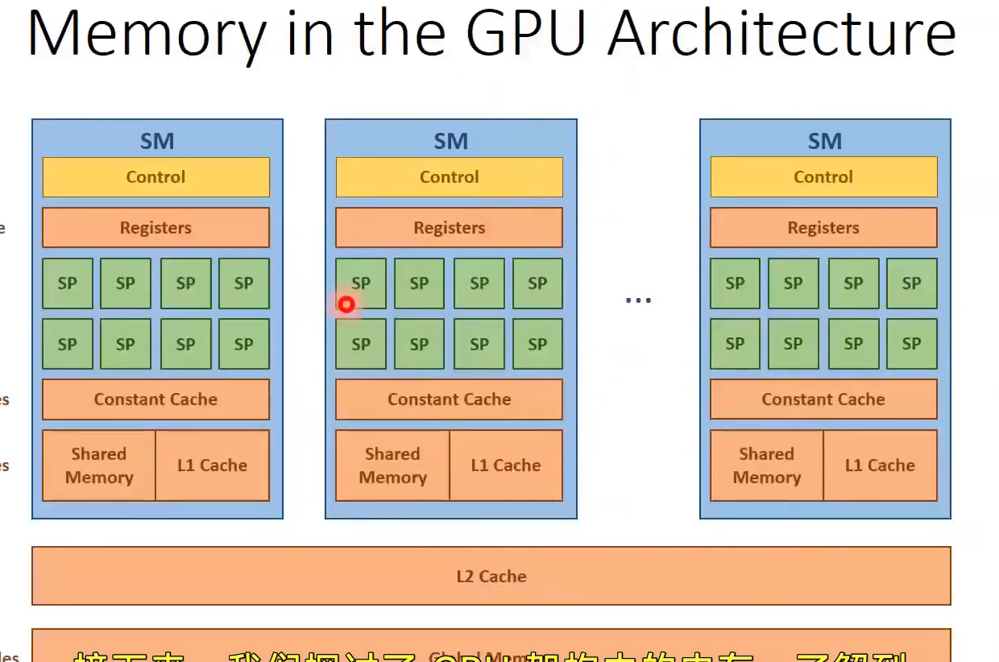

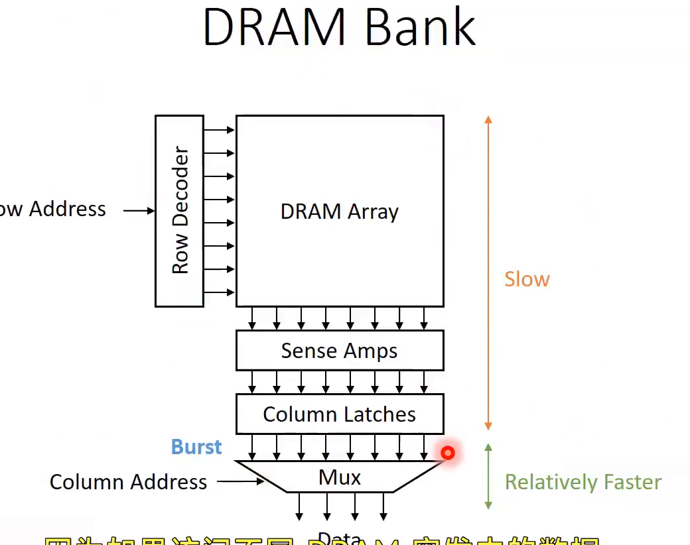
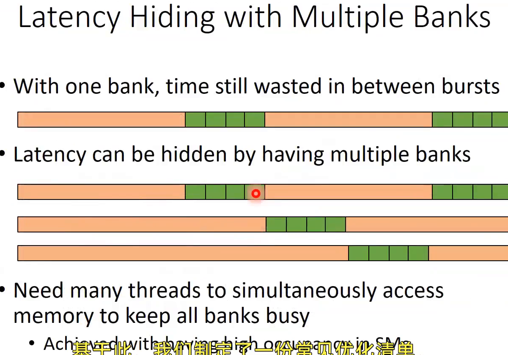
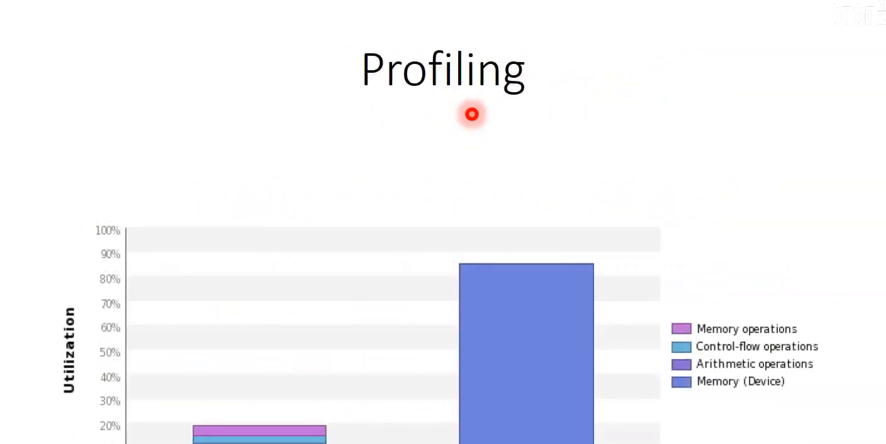


---

## Introduction to Convolution: 1D and 2D Concepts [13:15-31:50]

### 时间线叙事

**[13:15-13:56] | 卷积掩码与加权平均**
- 讲解者介绍卷积操作的核心概念：每个输出元素是相邻输入元素的加权和，这些权重由卷积掩码（convolution mask）决定。
- 为避免与CUDA内核（kernel）混淆，特意将卷积核称为“掩码”（mask），而非通常的“kernel”。
- 掩码由一组权重组成，将这些权重应用于输入，计算加权平均，从而得到输出值。
- 幻灯片显示“Convolution”标题，左侧为“input”网格（蓝色区域），中间为“mask”小网格（橙色高亮），右侧为“output”网格（绿色点），底部文字：“Every output element is a weighted sum of the neighboring input elements”。

**[14:00-14:44] | 卷积的应用**
- 卷积在信号处理、图像处理、视频处理等领域有广泛应用，用于将一维信号或二维像素转换为更理想的值。
- 具体应用示例：
  - 高斯模糊：距离中心较远的像素权重较小，比之前介绍的简单模糊更复杂。
  - 图像锐化
  - 边缘检测
- 卷积操作实现的变换效果完全取决于掩码中的权重值。
- 幻灯片标题为“Applications of Convolution”，列出上述应用点。

**[14:52-15:15] | 一维、二维与三维卷积**
- 讲解者以二维卷积作为本讲示例，因为它易于可视化且足够复杂。
- 同时指出，卷积可以是一维（处理信号）、二维（处理图像）或三维的。
- 幻灯片底部文字：“Using 2D as an example, but can also be 1D or 3D”。

**[15:17-16:12] | 卷积的并行化策略**
- 提问：基于已学内容，如何并行化卷积？
- 学生回答：类似于矩阵乘法，将图像拆分为矩阵，将对应值相乘并累加。
- 讲解者指出更简单的方案：与之前实现的图像模糊类似，为每个输出像素分配一个线程。
- 并行化方法：每个输出元素对应一个线程，该线程负责遍历相邻输入元素和掩码，计算加权和。
- 幻灯片显示“Parallelizing Convolution”标题，左侧“input”网格，中间“mask”网格，右侧“output”网格，底部文字：“Parallelization approach: Assign one thread to compute each output element by looping over input elements and mask weights”。

**[16:27-16:47] | 简单并行方法的说明**
- 这不是唯一的并行化方法，还有其他方式，但本讲采用此简单方法。
- 每个线程负责一个输出元素，通过循环遍历输入和掩码来计算。

**[16:47-17:28] | 掩码的特点与常量内存的引入**
- 掩码通常很小（例如5×5）。
- 所有线程访问的掩码是相同的。
- 掩码在内核执行期间不会改变（权重不变）。
- 基于这些特点，可以将掩码存储在一种特殊的内存中——常量内存（constant memory），以实现更快的访问。
- 幻灯片显示“Storing the Mask”标题，列出观察点：
  - The mask is typically small
  - The mask is constant (weights do not change)
  - The mask is accessed by all threads in the grid
- 优化方案：store the mask in constant memory for quicker access。

**[17:56-18:33] | CUDA编程模型中的内存回顾**
- 回顾CUDA编程模型中的内存层次：
  - 每个线程拥有自己的寄存器（registers）
  - 同一线程块内的线程共享共享内存（shared memory）
  - 网格中所有线程均可访问全局内存（global memory）
- 补充：网格中所有线程还可以访问常量内存（constant memory）。
- 目标：将掩码放入常量内存，因为常量内存的访问速度比全局内存更快。
- 幻灯片显示“Recall: Memory in the CUDA Programming Model”标题，图示包含Shared Memory、Registers、Global Memory、Constant Memory等层次。

**[18:40-19:15] | 常量内存的使用方法——代码概览**
- 切换到代码演示，展示已设置好的卷积实现代码框架。
- 代码结构：
  - 在GPU上分配输入和输出内存
  - 将输入数据复制到GPU
  - 将掩码复制到常量内存
  - 调用卷积内核
  - 将结果复制回主机
  - 释放分配的内存

**[19:18-19:52] | 声明常量内存数组**
- 使用`__constant__`关键字在全局作用域声明常量内存数组。
- 代码示例：
```c
__constant__ float mask_c[MASK_DIM][MASK_DIM];
```
- 命名约定：使用`_c`后缀表示常量内存（类似`_d`表示设备内存，`_h`表示主机内存）。
- 掩码尺寸由宏定义决定：
```c
#define MASK_RADIUS 2
#define MASK_DIM ((MASK_RADIUS)*2 + 1)  // 结果为5
```

**[21:28-22:00] | 从主机复制数据到常量内存**
- 常量内存不能在GPU执行时写入，必须从CPU端复制。
- 使用`cudaMemcpyToSymbol`函数将数据从主机复制到GPU常量内存。
- 代码示例：
```c
cudaMemcpyToSymbol(mask_c, mask, MASK_DIM * MASK_DIM * sizeof(float));
```
- 参数说明：
  - 目标指针：`mask_c`（常量内存中的数组名）
  - 源指针：`mask`（主机端的掩码数组）
  - 大小：`MASK_DIM * MASK_DIM * sizeof(float)`

**[23:01-23:52] | 常量内存的限制**
- 常量内存的一个重要限制：最多只能分配64KB。
- 这意味着不能将整个输入矩阵放入常量内存，尽管输入数据也是常量且不改变。
- 幻灯片显示“Using Constant Memory”标题，列出要点：
  - Declare constant memory array as global variable
  - Must initialize constant memory from the host (cannot modify during execution)
  - Can only allocate up to 64KB
  - Otherwise, input is also constant, but it is too large to put in constant memory

**[24:00-27:00] | 常量内存的动机与优势**
- 为什么常量内存更快？动机如下：
  1. **更容易构建高效缓存**：数据是常量，缓存只需支持读取，无需支持写入。
     - 不需要脏位（dirty bits）和写回（write back）机制
     - 不需要处理缓存一致性（cache coherence）问题
     - 多个线程同时访问同一缓存行时不会产生冲突
  2. **容量小，减少缓存驱逐**：常量内存总量小（64KB），缓存命中率高，驱逐次数少。
- 幻灯片显示“Motivation for Constant Memory”标题，逐步列出上述优势。

**[27:07-27:23] | GPU架构中的常量缓存**
- 从编程模型角度看，所有线程访问同一常量内存；但在硬件层面，每个SM内部有独立的常量缓存（constant cache），用于缓存常量内存数据。
- 常量缓存与L1缓存或共享内存不同。
- 幻灯片显示“Recall: Memory in the GPU Architecture”标题，图示SM内部包含Control、Registers、Constant Cache、Shared Memory、L1 Cache等组件，底部为L2 Cache。

**[27:34-28:24] | 学生提问：为何不用共享内存？**
- 学生提问：既然内核很小，为什么不直接把掩码放入共享内存（SM缓存）？
- 讲解者回答：共享内存由程序员管理，需要手动加载掩码并放入共享内存；而常量缓存由硬件自动管理，程序员无需额外操作。
- 幻灯片底部文字：“但共享内存由程序员管理的”（but shared memory is managed by the programmer）。

**[28:40-29:10] | 编写卷积内核代码**
- 在声明了常量内存并复制数据后，开始编写卷积内核函数。
- 内核代码与图像模糊内核非常相似：为每个输出元素分配一个线程。
- 计算输出行和列的索引：
```c
int outRow = blockIdx.y * blockDim.y + threadIdx.y;
int outCol = blockIdx.x * blockDim.x + threadIdx.x;
```

**[30:30-31:00] | 边界条件与累加器初始化**
- 添加边界条件检查，确保只有位于输入范围内的线程才进行计算：
```c
if (outRow < height && outCol < width) {
    // 进行计算
}
```
- 初始化累加器变量：
```c
float sum = 0.0f;
```

**[31:00-31:50] | 循环遍历掩码与输入**
- 接下来需要编写循环，遍历相邻输入元素和掩码权重，计算加权和。
- 循环的边界就是掩码的维度（MASK_DIM）。
- 讲解者指出：循环遍历输入和加权和，实际上就是遍历掩码的元素。

### 要点总结

本章介绍了卷积操作的基本概念（加权平均、掩码权重），以及如何在CUDA中高效实现卷积并行化。核心策略是为每个输出元素分配一个线程，利用常量内存存储掩码以加速访问。常量内存的优势在于硬件自动管理的常量缓存无需处理写入和缓存一致性问题，且容量小（64KB）保证了高缓存命中率。最后，通过代码演示了常量内存的声明、数据复制以及卷积内核的框架编写。

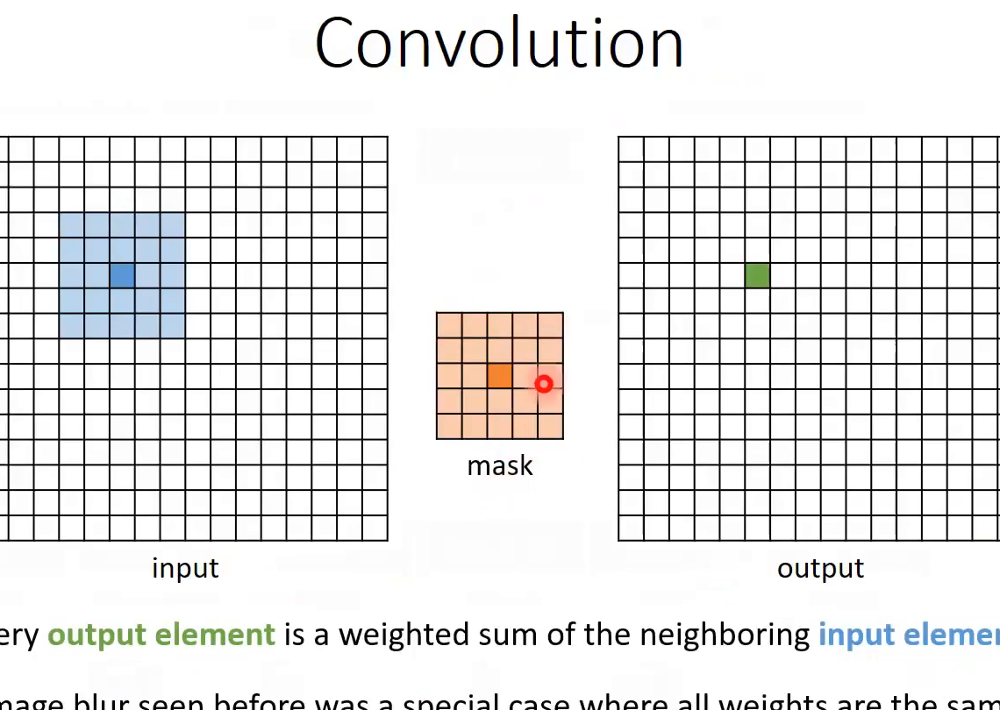
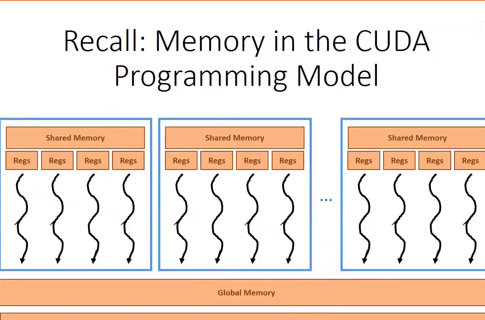
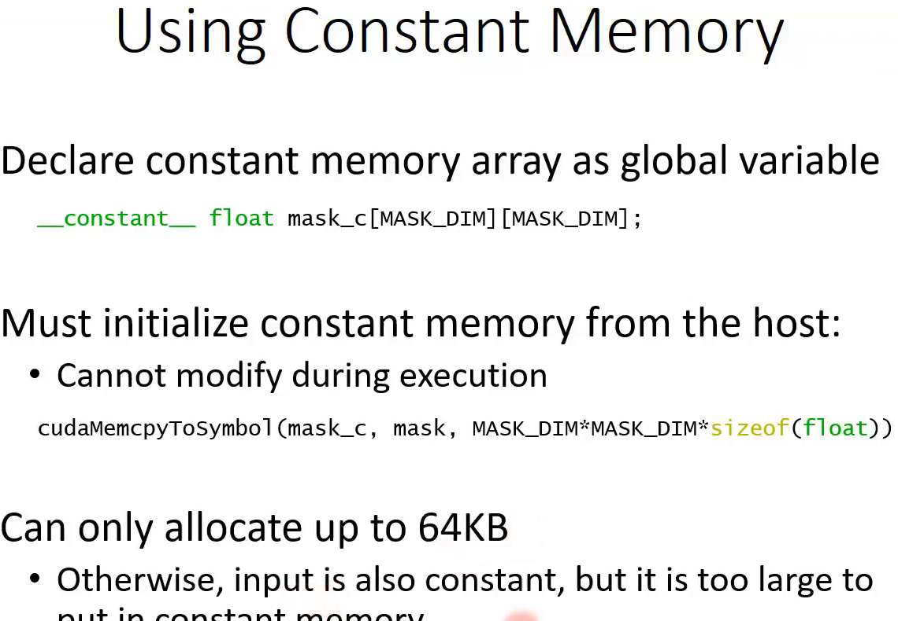
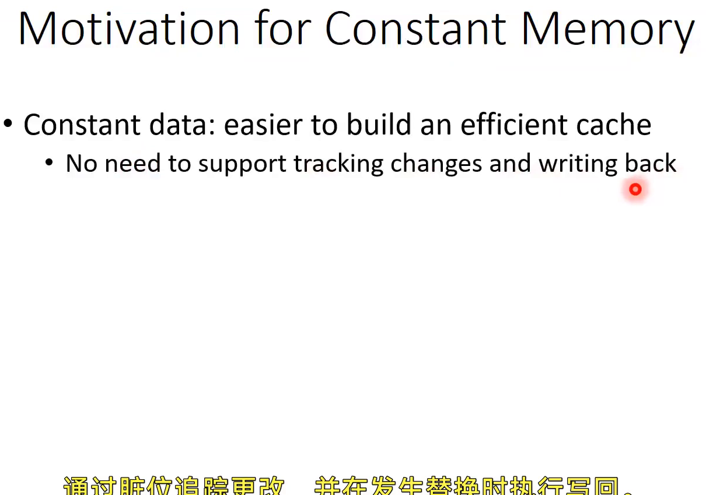
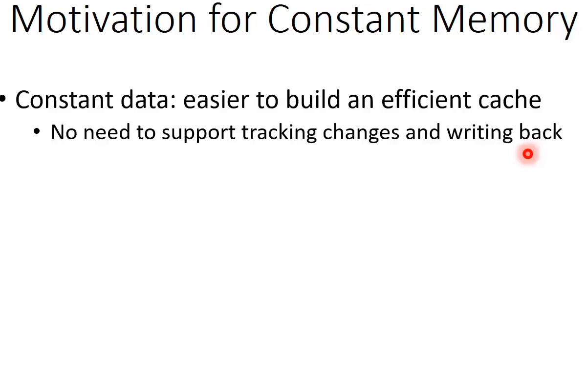


---

## 2D Convolution CUDA Implementation: Basic Kernel [31:50-47:36]

### 时间线叙事

**[31:50-32:35] | 定义掩码循环边界**
- 讲师开始编写卷积核函数中的循环部分，说明循环边界就是掩码的维度（mask dim）
- 定义外层循环：`for(int maskRow = 0; maskRow < MASK_DIM; ++maskRow)`
- 定义内层循环：`for(int maskCol = 0; maskCol < MASK_DIM; ++maskCol)`
- 这两个循环的作用是遍历掩码的所有元素，对于每个掩码元素，需要找到对应的输入值

**[32:36-33:05] | 计算输入索引的动机**
- 讲师需要计算输入行（inRow）和输入列（inCol）的索引
- 回到之前的图像示意图，解释如何根据输出位置和掩码位置推导输入位置
- 当前并行化策略：为每个输出元素分配一个线程，该线程循环遍历掩码和输入来计算加权和

**[33:06-34:50] | 学生提问：能否避免掩码循环？**
- 学生提问：在卷积中能否避免这些循环？
- 学生建议：是否可以通过依赖块来迭代所需内容，或者为每个输入元素分配线程？
- 讲师回答：可以尝试并行化这两个循环，但只有当输出并行度很低时才有利
- 对于典型的大尺寸输出（数千像素×数千像素），仅通过为每个输出分配线程就已经有足够并行度
- 如果输出很小导致GPU未充分利用，才值得考虑从掩码中提取并行性
- 实际上，有时甚至需要线程粗化（thread coarsening），让每个线程串行处理多个输出元素

**[34:51-36:30] | 计算输入行索引公式**
- 讲师回到代码编写，已有输出行（outRow）和输出列（outCol），以及掩码行（maskRow）和掩码列（maskCol）
- 需要找到对应的输入行和输入列
- 举例说明：假设输出行指向某个元素，掩码行为0（第一行），则对应的输入行是输出行减去掩码半径
- 掩码半径（mask radius）为2，掩码维度（mask dim）为5
- 公式推导：`inRow = outRow - maskRadius + maskRow`
- 当maskRow=0时，inRow = outRow - maskRadius；当maskRow=1时，inRow = outRow - maskRadius + 1

**[36:31-38:20] | 计算输入列索引公式**
- 同理，输入列公式：`inCol = outCol - maskRadius + maskCol`
- 当maskCol=0时，inCol = outCol - maskRadius；当maskCol=1时，inCol = outCol - maskRadius + 1
- 掩码半径定义为2，掩码维度定义为 `2 * maskRadius + 1 = 5`
- 完整代码框架如下：

```c
#include "common.h"
#include "timer.h"

#define OUT_TILE_DIM 32

__constant__ float mask_c[MASK_DIM][MASK_DIM];

__global__ void convolution_kernel(float* input, float* output, unsigned int width, unsigned int height) {
    int outRow = blockIdx.y * blockDim.y + threadIdx.y;
    int outCol = blockIdx.x * blockDim.x + threadIdx.x;

    if(outRow < height && outCol < width) {
        float sum = 0.0f;
        for(int maskRow = 0; maskRow < MASK_DIM; ++maskRow) {
            for(int maskCol = 0; maskCol < MASK_DIM; ++maskCol) {
                int inRow = outRow - MASK_RADIUS + maskRow;
                int inCol = outCol - MASK_RADIUS + maskCol;
                // 边界检查与累加
            }
        }
    }
}
```

**[38:21-39:30] | 累加加权和**
- 有了输入行和输入列后，可以进行累加：`sum += mask_c[maskRow][maskCol] * input[inRow * width + inCol]`
- 讲师先做累加，再处理边界检查，因为写出索引后更容易扩展边界检查
- 使用掩码行和掩码列索引掩码数组，使用输入行和输入列索引输入数组
- 输入索引计算：`inRow * width + inCol`

**[39:31-42:50] | 边界检查实现**
- 需要确保输入索引在有效范围内，因为输出元素可能在边缘，导致部分输入元素越界
- 掩码索引（maskRow, maskCol）始终在0到MASK_DIM之间，无需检查
- 需要检查输入行和输入列：
  - `inRow >= 0 && inRow < height`
  - `inCol >= 0 && inCol < width`
- 完整边界检查代码：

```c
if(inRow >= 0 && inRow < height && inCol >= 0 && inCol < width) {
    sum += mask_c[maskRow][maskCol] * input[inRow * width + inCol];
}
```

**[42:51-43:42] | 讨论控制发散问题**
- 学生提问：边界检查是否会导致控制发散（control divergence）？
- 讲师回答：是的，但控制发散程度不高，因为大多数线程都在有效范围内
- 只有边缘的少数线程会出现控制发散
- 实际中这种发散不可避免，不值得优化
- 真正需要优化的控制发散是所有线程都经历发散的情况，将在后续课程中举例

**[43:43-44:35] | 存储输出元素**
- 完成累加后，最后一步是存储输出元素：`output[outRow * width + outCol] = sum`
- 学生指出代码中的错误：输入索引应该是 `inCol` 而不是 `col`
- 讲师感谢学生的反馈，修正为 `input[inRow * width + inCol]`

**[44:36-45:20] | 编译运行与性能结果**
- 编译并运行代码，终端命令如下：

```bash
ie22@Dell7820:~/cmps297S-396AA/convolution$ make
nvcc -c -o kernel.o kernel.cu
nvcc main.o kernel.o -o convolution
ie22@Dell7820:~/cmps297S-396AA/convolution$ ./convolution
```

- 性能输出结果：

```
CPU time: 2051.213980 ms
Allocation time: 0.662000 ms
Copy to GPU time: 27.743001 ms
Copy to GPU constant memory time: 0.089000 ms
Kernel time: 5.172000 ms
Copy from GPU time: 47.584999 ms
Deallocation time: 4.482000 ms
GPU time: 85.772000 ms
```

- CPU时间约2000毫秒，GPU内核时间仅5毫秒，包含拷贝时间共85毫秒，性能提升显著

**[45:21-46:25] | 性能分析讨论**
- 学生提问：为什么卷积比向量加法加速比更大？
- 讲师解释原因：
  1. 卷积有大量数据重用（data reuse），缓存利用率好
  2. 一个输入（掩码）存储在常量内存中，访问速度快
  3. 另一个输入（全局内存）的访问模式规整，内存访问合并（coalesced）
  4. 同一块中的线程重用邻近数据

**[46:26-47:36] | 数据重用观察与优化提示**
- 回到代码幻灯片，观察数据重用模式
- 处理某个输出元素的线程会使用一组输入元素
- 下一个线程使用的输入元素与上一个有大量重叠
- 讲师提问：基于这个观察，我们可以做什么优化来捕获数据重用？
- 学生回答：线程粗化（coarsening）？讲师表示不完全正确
- 提示：之前学过的针对数据重用的优化是什么？暗示是分块（tiling）技术

### 要点总结

本章实现了基本的2D卷积CUDA内核，采用每个线程计算一个输出元素的并行化策略。核心内容包括：通过嵌套循环遍历掩码元素，利用公式 `inRow = outRow - maskRadius + maskRow` 和 `inCol = outCol - maskRadius + maskCol` 计算对应的输入索引，添加边界检查防止越界访问，以及累加加权和并存储结果。编译运行后GPU内核仅需5毫秒，相比CPU的2000毫秒获得约400倍加速，性能提升源于数据重用、常量内存使用和规整的内存访问模式。最后引出数据重用优化问题，为后续分块优化做铺垫。

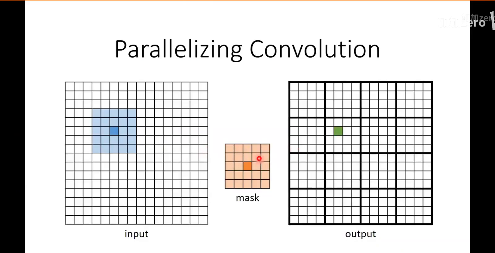
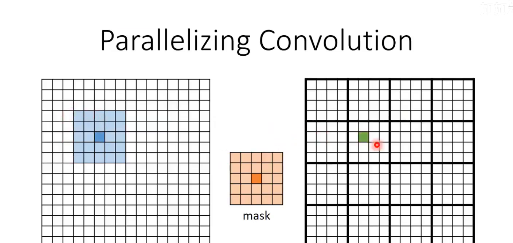


---

## Optimization: Tiling for Data Reuse in Convolution [47:36-66:01]

### 时间线叙事

**[47:36-48:40] | 分块优化的基本思想**
- 讲师指出，卷积优化的主要手段是数据重用，而正确的分块（tiling）是实现数据重用的关键优化。
- 观察发现，同一个线程块内的所有线程会使用部分相同的输入数据：一个输出分块（output tile）对应一个输入分块（input tile）。
- 优化方案：让每个线程只加载一个输入元素到共享内存（shared memory）中，这样其他线程就可以从共享内存访问该元素，而不是每个线程都从全局内存重复加载。
- 具体做法：所有线程共同将整个输入分块加载到共享内存（每个线程加载一个元素），然后这些线程在共享内存中循环遍历掩码（mask）和输入分块，执行卷积操作。

**[48:40-49:40] | 输入分块与输出分块尺寸差异**
- 讲师指出，卷积的分块与矩阵乘法的分块存在一个重要区别：在矩阵乘法中，输入分块和输出分块尺寸相同，每个线程加载一个输入元素并计算一个输出元素。
- 但在卷积中，输入分块实际上比输出分块大。具体关系为：
  - 输入分块尺寸 = 输出分块尺寸 + 2 × 掩码半径（mask radius）
  - 例如，如果掩码尺寸为5×5，则掩码半径为2，输入分块在每边都比输出分块大2个元素。

**[49:40-51:40] | 线程分配策略**
- 由于输入分块和输出分块尺寸不同，不能简单地让每个线程加载一个输入元素并计算一个输出元素。
- 解决方案：线程块的大小（线程数量）对应于输入分块的元素数量，即线程块尺寸 = 输入分块尺寸。
- 所有线程在加载输入分块时都处于活跃状态，但只有一部分线程（对应于输出分块内的元素）在计算和存储输出分块时处于活跃状态。
- 这种策略称为“过度配置”（over provisioning）：部分线程只负责加载输入数据而不参与计算。
- 另一种可能的方案是让线程数量等于输出分块元素数量，然后让这些线程循环加载输入分块，但这种方法代码复杂且性能提升有限。

**[51:40-52:30] | 作业说明**
- 讲师说明，下一次作业将要求学生自己实现分块卷积的代码。
- 具体要求：启动与输入分块元素数量相等的线程，所有线程用于加载输入分块，只有部分线程用于计算输出分块。

**[52:30-55:00] | 无分块版本的计算与内存访问比分析**
- 假设掩码尺寸为M×M，分析无分块版本的计算与全局内存访问比。
- 每个线程的全局内存加载次数：每个线程需要加载M²个输入元素（每个元素4字节），因此全局内存加载量为M² × 4字节。
- 每个线程的浮点运算次数：每个输出元素需要M²次乘法和M²次加法，共2M²次浮点运算。
- 计算与内存访问比 = 2M² OP / (4M² B) = 0.5 OP/B（操作每字节）。
- 注意：掩码（mask）存储在常量内存中，不计入全局内存加载。

**[55:00-56:10] | 分块版本的计算与内存访问比分析**
- 分析分块版本时，以线程块为单位进行分析更为方便，因为部分线程只加载数据不参与计算。
- 每个线程块的操作数：
  - 输出分块尺寸 = T（假设输入分块尺寸为T，则输出分块尺寸为T-M+1）
  - 每个输出元素需要M²次乘法和M²次加法，共2M²次浮点运算
  - 总操作数 = (T-M+1)² × 2M² OP
- 每个线程块的全局内存加载量：
  - 输入分块尺寸为T，每个元素4字节
  - 总加载量 = T² × 4 B
- 计算与内存访问比 = [(T-M+1)² × 2M²] / (T² × 4) = 0.5M² × [1 - (M-1)/T]² OP/B

**[56:10-59:40] | 公式推导与数值示例**
- 讲师详细推导了上述公式，并给出数值示例：
  - 当M=5（掩码尺寸5×5），T=32（输入分块32×32）时：
  - 计算与内存访问比 = 0.5 × 25 × [1 - 4/32]² = 12.5 × (7/8)² ≈ 9.57 OP/B
- 与无分块版本的0.5 OP/B相比，分块带来了约19倍的提升。
- 讲师指出，矩阵乘法分块在相同条件下（32×32分块）可带来32倍提升，因为矩阵乘法中输入分块与输出分块尺寸相同，没有“边界开销”。

**[59:40-61:40] | 数据类型对计算与内存访问比的影响**
- 有学生提问：卷积主要用于图像处理，是否可以用整数（如8位整数）代替浮点数来优化？
- 讲师回答：如果输入数据是8位整数（1字节），则计算与内存访问比会相应变化：
  - 全局内存加载量变为T² × 1字节（而不是4字节）
  - 浮点运算变为整数运算
  - 这本质上是不同类型的卷积，而非优化技巧
- 如果确实需要浮点运算（如非图像应用），则必须使用浮点数。

**[61:40-64:10] | 边界条件处理**
- 讲师介绍分块卷积中边界条件的处理方法：
- 方法一：在加载输入分块到共享内存后，计算时检查原始全局内存访问是否越界。
- 方法二（更常用）：加载输入分块时，对于越界的元素（称为“幽灵元素”ghost elements），直接加载0值到共享内存。
- 采用方法二的好处：在共享内存中计算时，所有元素都是有效的，无需再检查边界条件，代码更简洁。

**[64:10-66:01] | 课程总结与教材参考**
- 讲师总结：分块技术显著提升了计算与内存访问比，是卷积优化的核心手段。
- 建议学生阅读教材第7章（David B. Kirk and Wen-mei W. Hwu. Programming Massively Parallel Processors: A Hands-on Approach, Morgan Kaufmann, 2016）以获取更多细节。
- 讲师询问是否有最终问题，若无则结束课程。

### 要点总结

本章核心内容为卷积操作中通过分块（tiling）实现数据重用的优化技术。关键点包括：输入分块尺寸比输出分块尺寸大2倍掩码半径；通过过度配置线程（线程数等于输入分块元素数）实现加载与计算的分离；分块可将计算与内存访问比从0.5 OP/B提升至约9.57 OP/B（19倍提升）；边界条件可通过加载0值到共享内存的方式简化处理。学习目标为理解分块卷积的原理、计算与内存访问比的推导方法，以及边界条件的处理策略。

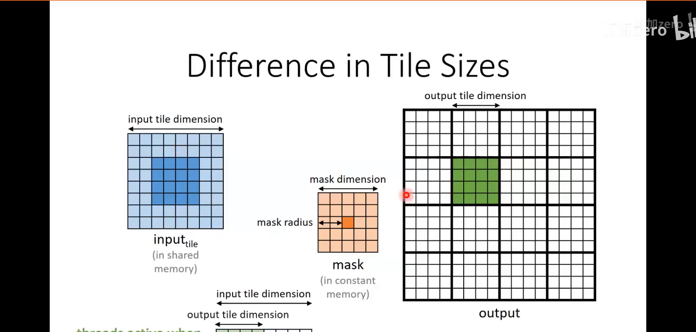

