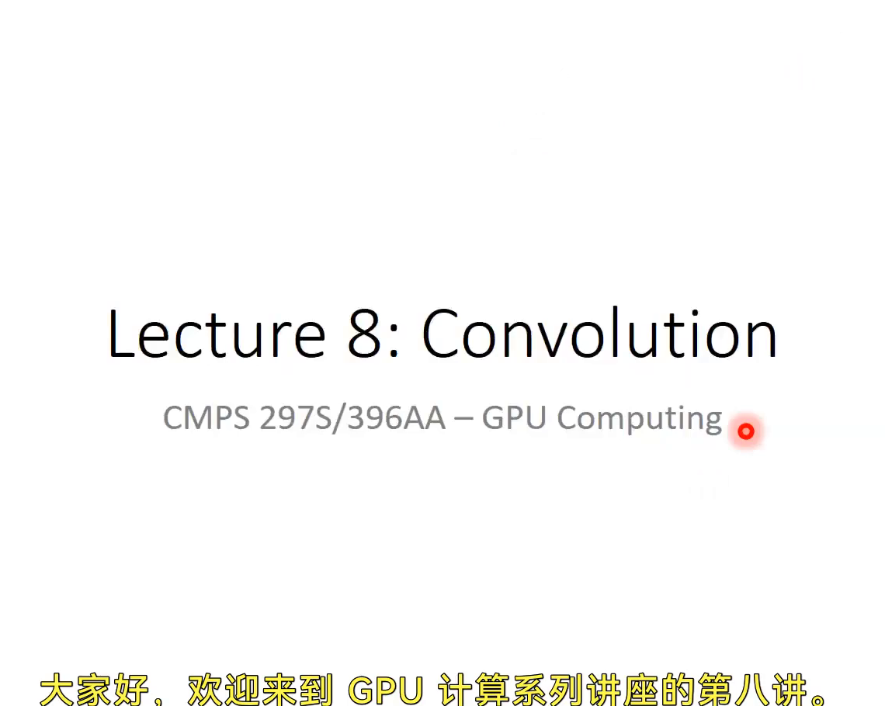
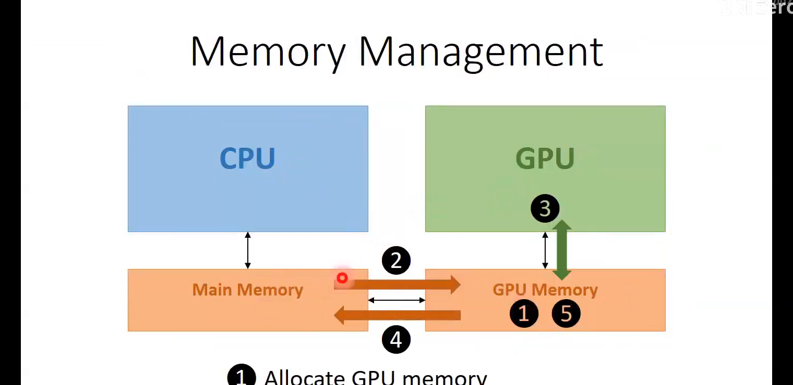
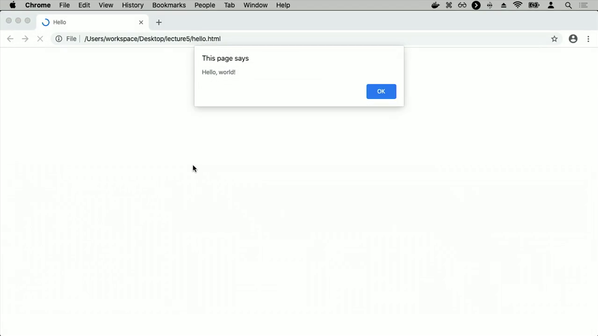
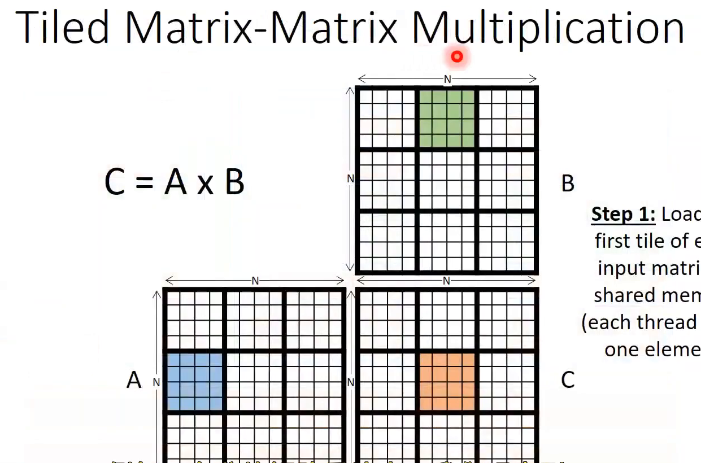
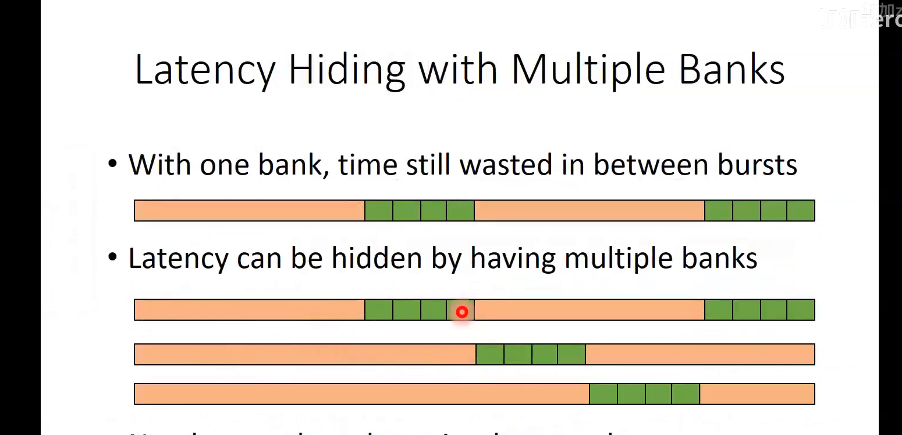
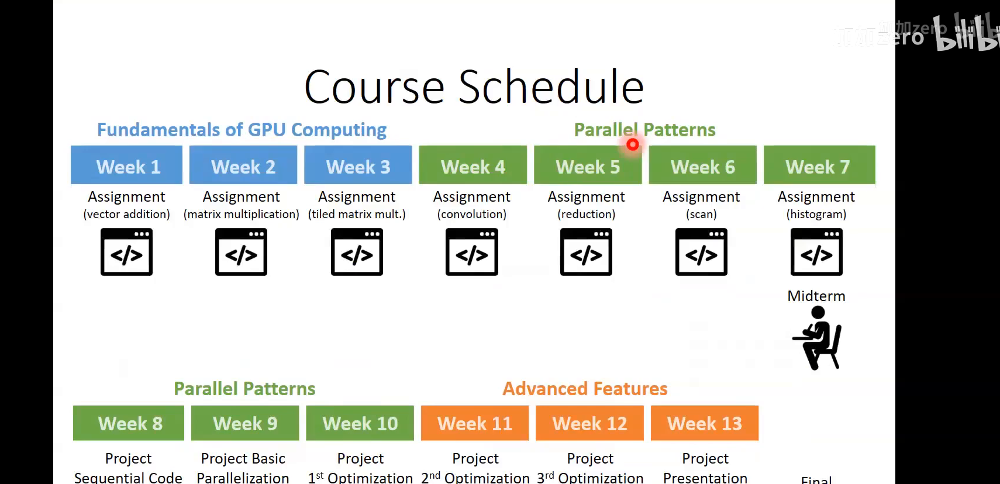
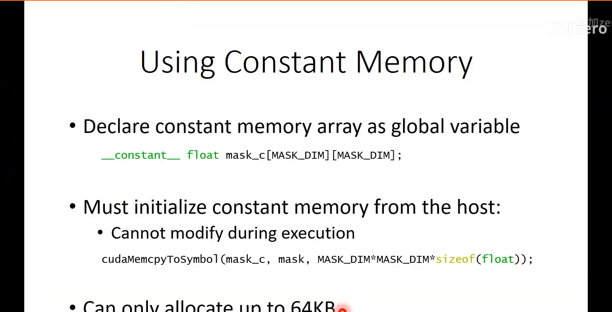
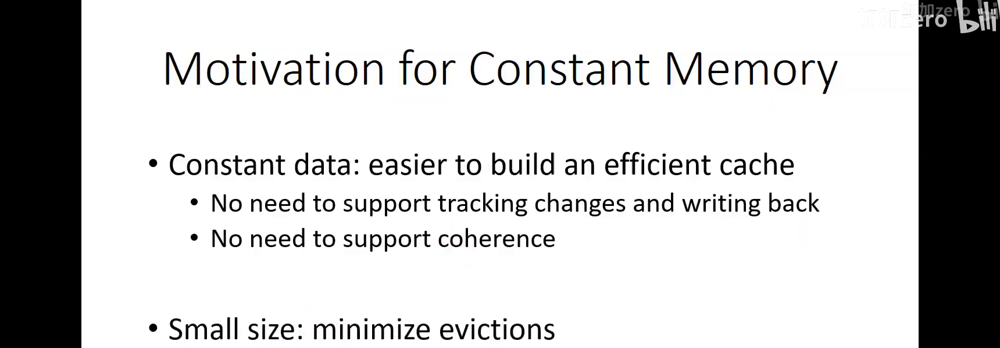

# 视频结构化总结

> 共 4 个章节

## 目录

1. 第八讲开场引入卷积并行模式 [00:00-06:00]
2. 讲解延迟隐藏技术相关原理 [06:00-11:12]
3. 介绍并行模式配套优化及特性 [11:12-61:28]
4. 开展相关参数公式计算推导 [61:28-66:01]

---

---

## 第八讲开场引入卷积并行模式 [00:00-06:00]

### 时间线叙事

**[00:00-00:14] | 开场与课程主题引入**
- 讲师欢迎学生进入GPU计算系列讲座第八讲，幻灯片标题为“Lecture 8: Convolution”，副标题显示课程代码“CMPS 297S/396AA – GPU Computing”。
- 宣布今天开始讨论并行模式（parallel patterns），第一个要讲解的并行模式是卷积（convolution）。
- 在进入新主题前，讲师计划先回顾之前课程已覆盖的基础内容。

**[00:14-00:47] | 回顾：单线程性能停滞与并行计算转向**
- 幻灯片显示“Processor Trends”图表，横轴为1970年至2020年，纵轴包含晶体管数量（千）、单线程性能（SpecINT x 10^4）、频率（MHz）、典型功耗（Watts）和逻辑核心数。
- 图表中单线程性能和频率曲线在2000年后趋于平缓，被红色圆圈标记。
- 讲师解释：课程初期讨论了单线程性能因功耗墙（power wall）导致频率停滞，从而推动了向并行计算的转变。
- 指出这一趋势使得晶体管被用于增加处理器核心数量。

**[00:47-01:28] | 回顾：CPU与GPU设计哲学对比**
- 幻灯片显示“Approaches to Processor Design”对比图。
- **CPU（延迟导向设计）**：
  - 使用少量强大的ALU（减少操作延迟）
  - 大型缓存（将长延迟内存访问转换为短延迟缓存访问）
  - 复杂控制逻辑（分支预测减少控制冒险，数据转发减少数据冒险）
  - 少量多线程用于隐藏剩余延迟
  - 目标：让单个任务尽可能快
- **GPU（吞吐量导向设计）**：
  - 使用大量小型ALU（长延迟但高吞吐量，深度流水线化）
  - 小型缓存（更多面积用于计算）
  - 简单控制逻辑（更多面积用于并行计算）
  - 通过大量线程隐藏操作的高延迟
  - 目标：最大化整体吞吐量

**[01:28-02:34] | 回顾：GPU内存管理与典型使用流程**
- 幻灯片显示“Memory Management”示意图，左侧为CPU和主内存（Main Memory），右侧为GPU和GPU内存（GPU Memory）。
- 典型GPU使用流程包含5个步骤：
  1. 分配GPU内存（Allocate GPU memory）
  2. 将数据从CPU主内存复制到GPU内存（Copy data to GPU memory）
  3. 在GPU上执行内核，访问GPU内存中的数据（Perform computation on GPU）
  4. 将结果从GPU内存复制回CPU主内存（Transfer results back）
  5. 释放GPU内存（Free GPU memory）
- 讲师提到还有统一内存（unified memory）等其他方式，可以在CPU上分配数据并在GPU上直接使用，后续课程会讨论。

**[02:34-03:09] | 回顾：向量加法与数据并行性**
- 幻灯片显示“Parallel Vector Addition in CUDA”，包含输入向量x、y和输出向量z。
- 展示向量加法的CUDA内核代码：
```cpp
__global__ void vecadd_kernel(float* x, float* y, float* z) {
    int i = blockIdx.x * blockDim.x + threadIdx.x;
}
```
- 讲师解释：数据并行性适合GPU，向量加法是数据并行性的“Hello World”示例。
- 网格（grid）组织为线程和块（threads and blocks），通过计算线程索引，每个线程对不同数据执行相同操作。

**[03:09-03:44] | 回顾：多维索引与数据布局**
- 幻灯片显示“Multidimensional Indexing”，说明内置维度变量包含x、y、z三个分量。
- 幻灯片显示“Layout of Multidimensional Data”，解释C语言采用行主序（row major order）存储数据，同一行的元素在内存中连续。
- 展示4x4矩阵的逻辑视图：
```
0,0  0,1  0,2  0,3
1,0  1,1  1,2  1,3
2,0  2,1  2,2  2,3
3,0  3,1  3,2  3,3
```
- 讲师强调：访问多维数据时，需要将线程获得的二维索引转换为一维索引，以访问动态分配的数组。

**[03:44-03:59] | 回顾：已完成的示例应用**
- 讲师列举已完成的多维数据并行示例：
  - RGB到灰度转换（RGB to grayscale conversion）
  - 图像模糊（image blur）——这是卷积的一个特例，今天将正式讨论
  - 矩阵-矩阵乘法（matrix-matrix multiplication）
- 幻灯片显示“Example: Matrix-Matrix Multiplication”，公式C = A x B，并指出这个例子将在后续几节课中继续使用。

**[03:59-04:20] | 回顾：GPU架构与SM组织**
- 幻灯片显示“GPU Architecture”，说明GPU由多个流多处理器（Streaming Multiprocessors, SMs）组成。
- 每个SM包含多个共享控制和内存的核心，所有SM访问同一全局内存。
- 示例：Volta V100 GPU有80个SM，每个SM有64个核心，总计5120个核心。

**[04:20-04:55] | 回顾：块调度与线程束**
- 幻灯片显示“Assigning Blocks to SMs”，说明线程以块粒度分配给SM，同一块中的所有线程分配到同一个SM。
- 线程/块需要资源（寄存器、内存等）才能执行，因此SM一次只能容纳有限数量的线程/块，剩余块等待其他块完成后才能被分配。
- 幻灯片显示“Warps”：
  - 线程束（warp）是SM中的调度单元
  - 线程束大小是设备特定的，但至今一直是32个线程
  - 同一线程束中的线程一起调度，按照SIMD模型执行：单指令多数据（Single Instruction, Multiple Data）
  - 线程束中的所有线程获取并执行同一条指令，每个线程处理不同数据

**[04:55-05:54] | 回顾：控制分歧问题**
- 幻灯片显示“Control Divergence Example”，展示条件分支代码：
```cpp
if(threadIdx.x < 24) {
    A
} else {
    B
}
```
- 讲师解释控制分歧的执行过程：
  1. 同一线程束中不同线程可能选择不同控制路径（then部分或else部分）
  2. 由于所有线程必须执行相同指令，实际执行时：所有线程先执行then部分，选择then的线程活跃，选择else的线程不活跃
  3. 然后所有线程执行else部分，选择else的线程活跃，选择then的线程不活跃
- 后果：不活跃的线程占用核心但不做任何工作，导致硬件利用率低下（underutilization）
- 讲师预告：未来讨论并行模式时会展示如何最小化控制分歧

**[05:54-06:00] | 过渡至延迟隐藏**
- 幻灯片显示“Latency Hiding”，说明当一个线程束需要等待高延迟操作时，另一个准备好的线程束会被选中并调度执行。
- 讲师提到：通过在SM上调度比实际核心数量更多的线程束和线程，可以实现线程过订阅（oversubscription），从而隐藏延迟。
- 章节结束，为后续卷积并行模式的正式讲解做铺垫。

### 要点总结

本章作为第八讲的开场，系统回顾了GPU计算的基础知识，包括单线程性能停滞推动并行计算、CPU与GPU的设计哲学差异、GPU内存管理流程、数据并行性与向量加法、多维索引与数据布局、GPU架构与SM组织、线程束调度以及控制分歧问题。这些回顾为引入第一个并行模式——卷积——奠定了理论基础，帮助学生在进入新主题前巩固已学内容。






---

## 讲解延迟隐藏技术相关原理 [06:00-11:12]

### 时间线叙事

**[06:00-06:29] | 延迟隐藏的基本原理**
- 延迟隐藏的核心思想：通过在SM上调度比核心数量多得多的warp和线程，实现线程的过度订阅（oversubscription）。
- 具体机制：当一个warp遇到长延迟操作（如内存访问）时，调度器会立即将其移除，并换入另一个准备好的warp执行。这个过程持续进行，直到原始warp完成其长延迟操作。
- 这种上下文切换机制使得计算核心在等待期间不会空闲，从而有效隐藏了延迟。

**[06:30-06:50] | 占用率（Occupancy）的概念**
- 为了有效隐藏延迟，需要在SM上调度大量线程，这引出了“占用率”的概念。
- 占用率定义为每个SM上实际活跃线程数与最大线程数的比值。
- 不同设备的每个SM最大线程数不同，例如在V100上为2048个线程。
- 占用率受多种资源约束限制，包括：每个SM的最大块数、每个线程可用的寄存器数量、每个SM的共享内存大小。

**[06:51-07:11] | 占用率的约束因素**
- 占用率约束表格展示了不同GPU架构的参数差异：
  - K40（Kepler）：每个SM 192核心，最大2048线程，最大16个块
  - M40（Maxwell）：每个SM 128核心，最大2048线程，最大32个块
  - P100（Pascal）：每个SM 64核心，最大2048线程，最大32个块
  - V100（Volta）：每个SM 64核心，最大2048线程，最大32个块
- 每个SM的寄存器数量统一为64K，共享内存大小因架构而异（K40:48KB, M40:96KB, P100:64KB, V100:96KB）
- 必须关注资源利用率，以确保最大化SM上的线程数量。

**[07:12-07:30] | GPU架构中的共享内存**
- GPU架构中，同一SM上的线程可以访问共享内存（Shared Memory）。
- 共享内存位于SM内部，访问速度远快于全局内存（Global Memory）。
- 共享内存可用于线程间协作和数据复用，减少对全局内存的访问次数。

**[07:31-08:14] | 分块矩阵乘法（Tiled Matrix Multiplication）**
- 背景：传统矩阵乘法中，每个线程需要加载整行A和整列B，导致大量全局内存访问。
- 优化方法：采用分块策略，将矩阵划分为多个tile（子块）。
- 具体步骤：
  1. 将每个输入矩阵的第一个tile加载到共享内存中，每个线程只加载一个元素
  2. 线程在共享内存中完成计算
  3. 利用其他线程加载的tile元素进行协作计算
- 效果：最小化全局内存访问次数，提高计算与全局内存访问的比率。

**[08:15-08:38] | DRAM组织结构与访问特性**
- DRAM bank内部结构包括：行解码器（Row Decoder）、DRAM阵列（DRAM Array）、感测放大器（Sense Amps）、列锁存器（Column Latches）、多路复用器（Mux）
- 访问DRAM阵列的速度较慢，但一旦完成突发（burst）读取，访问突发内的数据速度较快。
- 最佳实践：线程发出的内存请求应尽量访问同一DRAM突发中的数据。

**[08:39-09:10] | 不同DRAM突发访问的性能差异**
- 访问不同DRAM突发：需要重新访问DRAM阵列，导致额外延迟
- 访问同一DRAM突发：只需读取DRAM阵列一次，后续数据从突发缓冲区直接服务，无需返回阵列
- 时间线对比显示，访问同一突发比访问不同突发快得多

**[09:11-09:40] | 多bank延迟隐藏**
- 单个bank的问题：突发之间的时间仍然被浪费
- 多bank解决方案：通过同时操作多个DRAM bank来隐藏延迟
  - 从一个bank的DRAM阵列读取时，同时从另一个bank的突发缓冲区服务数据
- 需要大量线程同时访问内存，以保持所有bank忙碌
- 最大化占用率不仅有助于隐藏流水线延迟，还能提供大量内存访问请求，帮助隐藏内存访问延迟

**[09:41-10:00] | 常见优化清单**
- 优化清单表格包含四列：优化项、改进内容、对核心的影响、对内存的影响
- 具体优化项：
  1. 调整资源以最大化占用率：改进延迟隐藏，对核心影响是更多工作隐藏流水线延迟，对内存影响是更多访问隐藏DRAM延迟
  2. 最小化控制分歧：改进SIMD效率，减少核心执行时的空闲周期
  3. 统一内存访问模式：实现内存合并，减少等待内存的流水线停顿，更好利用突发/缓存行
  4. 共享内存分块：实现数据复用，减少等待内存的流水线停顿，减少全局内存流量
  5. 线程粗化：降低并行化成本，减少冗余工作或同步，减少全局内存流量
  6. 私有化（后续覆盖）：减少公共输出的竞争，减少等待内存的流水线停顿，减少全局内存流量和串行化

**[10:01-10:38] | 瓶颈识别与优化选择**
- 选择哪些优化措施取决于应用程序当前遇到的性能瓶颈
- 优化本质上是资源之间的权衡：用充裕的资源换取瓶颈资源
- 必须正确诊断应用程序的瓶颈，否则可能优化了错误的资源
- 瓶颈定义：限制应用程序在设备上性能的约束条件
- 瓶颈取决于应用程序本身和设备的特性

**[10:39-11:00] | 性能分析工具**
- CUDA提供了性能分析工具（Profiling），用于分析应用程序的资源利用情况
- 分析结果以柱状图形式展示，横轴分为Compute和Memory (Device)，纵轴为利用率
- 柱状图包含三类数据：内存操作、控制流操作、算术操作
- 通过分析可以评估哪些资源被充分利用，哪些未被充分利用，从而确定瓶颈所在

**[11:01-11:12] | 课程回顾与展望**
- 本部分（GPU计算基础）内容回顾完毕
- 下一部分将深入讲解并行模式（Parallel Patterns），包括：卷积、归约、扫描、直方图等
- 课程时间表显示：
  - 第1-3周：GPU计算基础（向量加法、矩阵乘法、分块矩阵乘法）
  - 第4-7周：并行模式（卷积、归约、扫描、直方图）
  - 第8-13周：高级特性与项目优化

### 要点总结

本章系统讲解了GPU延迟隐藏技术的核心原理，包括通过线程过度订阅和warp调度来掩盖长延迟操作，以及占用率的概念及其受寄存器、共享内存等资源约束的影响。同时介绍了共享内存分块优化、DRAM突发访问特性、多bank延迟隐藏等关键技术，并提供了常见优化清单和性能分析工具的使用方法，为后续并行模式的学习奠定基础。






---

## 介绍并行模式配套优化及特性 [11:12-61:28]

### 时间线叙事

**[11:12-11:32] | 课程目标与并行模式学习框架**
- 讲师介绍课程目标：通过讲解每个并行模式，引入新的架构特性或优化技术
- 学习并行模式的同时，利用这些模式来学习新的优化技术、新技巧或新硬件特性
- 今天将从卷积（convolution）开始，这是第一个并行模式

**[11:32-12:05] | 今日主题：卷积与常量内存**
- 确认无问题后，讲师宣布今日内容：第一个并行模式——卷积
- 同时利用卷积来介绍GPU架构和CUDA编程模型的新特性——常量内存（constant memory）

**[12:05-12:45] | 卷积操作定义**
- 卷积操作：输入经过处理后，输出的每个元素是对应输入元素及其邻域的加权和
- 以二维卷积为例，每个输出元素是相邻输入元素的加权和
- 图像模糊（image blur）是卷积的一个特例，其中所有权重相同

**[12:45-13:37] | 卷积的一般形式与掩码概念**
- 图像模糊是卷积的特例，一般形式的卷积中每个输入元素可以有不同权重
- 权重由卷积掩码（convolution mask）决定，讲师特意使用"mask"而非"kernel"以避免与CUDA内核函数混淆
- 掩码由一组权重组成，应用于输入数据
- 计算过程：根据掩码中的权重计算输入的加权平均，得到输出

**[13:37-14:51] | 卷积的应用领域**
- 卷积广泛应用于信号处理、图像处理、视频处理等领域
- 用于将一维信号或二维像素转换为更理想的值
- 示例：高斯模糊（距离中心越远的像素权重越小）、图像锐化、边缘检测等
- 变换效果取决于掩码中的权重设置
- 以二维卷积为例讲解，但一维和三维卷积同样存在

**[14:51-16:34] | 卷积的并行化策略**
- 讲师提问：什么是并行化卷积的好方法？
- 学生回答：类似于矩阵操作，将图像分解为矩阵集合并进行乘加运算
- 讲师指出更简单的方法：每个输出像素分配一个线程（one thread per output pixel）
- 每个线程负责遍历相邻输入元素和掩码，计算加权和
- 这是今天采用的方法，但不是唯一方法

**[16:34-17:46] | 掩码存储优化：常量内存的引入**
- 观察掩码特性：通常很小（例如5×5）、权重不变（常量）、被网格中所有线程访问
- 基于这些特性，可以将掩码存储在常量内存（constant memory）中，实现更快的访问
- 常量内存是CUDA编程模型中所有线程都可访问的特殊内存区域

**[17:46-18:42] | CUDA编程模型内存回顾**
- 回顾CUDA内存层次：每个线程有自己的寄存器，同一块中的线程共享共享内存，所有线程可访问全局内存
- 补充：所有线程还可访问常量内存
- 目标：将掩码放入常量内存，其访问速度比全局内存更快

**[18:42-19:17] | 代码实现：设置卷积GPU函数**
- 讲师切换到代码编辑器，展示卷积实现代码
- GPU函数功能：分配输入和输出内存、复制输入数据、复制掩码到常量内存、调用卷积内核、复制结果回主机、释放内存

**[19:17-20:28] | 声明常量内存数组**
- 使用`__constant__`关键字声明全局常量内存数组：
```c
__constant__ float mask_c[MASK_DIM][MASK_DIM];
```
- 命名约定：使用`_c`后缀表示常量内存（类似`_d`表示设备内存，`_h`表示主机内存）
- 掩码定义为二维数组，尺寸为MASK_DIM × MASK_DIM

**[20:28-21:24] | 掩码尺寸定义**
- 在头文件中定义掩码半径和尺寸：
```c
#define MASK_RADIUS 2
#define MASK_DIM ((MASK_RADIUS)*2 + 1)
```
- 掩码半径=2，表示每边各2个元素，加上中心元素，总尺寸为5×5

**[21:24-22:52] | 从主机复制数据到常量内存**
- 常量内存不能在GPU执行时写入，必须从CPU端初始化
- 使用`cudaMemcpyToSymbol`函数复制数据到常量内存：
```c
cudaMemcpyToSymbol(mask_c, mask, MASK_DIM*MASK_DIM*sizeof(float));
```
- 参数：目标符号（mask_c）、源指针（mask）、数据大小

**[22:52-23:54] | 常量内存的限制**
- 常量内存只能分配最多64KB
- 如果矩阵乘法中的输入矩阵A和B也是常量，但由于尺寸太大无法放入常量内存
- 这是常量内存的权衡：速度快但容量小

**[23:54-25:06] | 常量内存为何更快（一）：缓存设计简化**
- 常量数据更容易构建高效缓存
- 不需要支持写入缓存：无需脏位（dirty bits）和写回（write back）操作
- 只需构建只读缓存，硬件设计更简单

**[25:06-26:36] | 常量内存为何更快（二）：无需缓存一致性**
- 在多线程并行处理器中，多个线程同时访问同一缓存行会产生冲突
- 可写缓存需要缓存一致性协议（cache coherence protocols）来保证数据一致性
- 常量数据不需要支持缓存一致性，进一步简化硬件设计

**[26:36-27:28] | 常量内存为何更快（三）：容量小减少缓存未命中**
- 常量内存容量小（64KB），可以完全放入缓存中
- 缓存未命中率低，因为常量内存总量小
- 每个SM内部有独立的常量缓存（constant cache），与L1缓存或共享内存不同

**[27:28-28:30] | 常量内存与共享内存的对比讨论**
- 学生提问：为什么不直接把掩码放入共享内存？
- 讲师回答：共享内存由程序员管理，需要手动加载掩码；常量内存由硬件管理，更简单
- 常量缓存由硬件管理，共享内存由程序员管理

**[28:30-29:23] | 编写卷积内核代码**
- 现在已分配常量内存并复制数据，接下来编写卷积内核
- 与图像模糊内核非常相似
- 每个线程分配一个输出元素

**[29:23-30:28] | 计算输出行和列索引**
- 计算输出行索引：
```c
int outRow = blockIdx.y * blockDim.y + threadIdx.y;
```
- 计算输出列索引：
```c
int outCol = blockIdx.x * blockDim.x + threadIdx.x;
```

**[30:28-31:02] | 边界条件检查与累加器初始化**
- 确保只有边界内的线程进行计算：
```c
if(outRow < height && outCol < width) {
```
- 初始化浮点累加器：
```c
float sum = 0.0f;
```

**[31:02-32:35] | 遍历掩码的循环结构**
- 循环遍历掩码的行和列：
```c
for(int maskRow = 0; maskRow < MASK_DIM; ++maskRow) {
    for(int maskCol = 0; maskCol < MASK_DIM; ++maskCol) {
        // 计算对应的输入元素索引
    }
}
```
- 循环边界就是掩码的维度MASK_DIM

**[32:35-33:12] | 计算输入元素索引**
- 学生提问：能否避免循环？讲师解释：对于典型的大尺寸输出，输出级并行度已足够，不需要并行化掩码循环
- 输入行索引计算：
```c
int inRow = outRow - MASK_RADIUS + maskRow;
```
- 输入列索引计算：
```c
int inCol = outCol - MASK_RADIUS + maskCol;
```
- 原理：从输出位置减去掩码半径，再加上掩码内的偏移量

**[33:12-38:28] | 关于循环的讨论**
- 学生建议避免循环，讲师解释：当前并行化方法是为每个输出元素分配一个线程，线程循环遍历掩码
- 如果输出很小，可以考虑并行化掩码循环；但典型工作负载下输出足够大，不需要
- 甚至可能应用线程粗化（thread coarsening），让每个线程串行处理多个输出元素

**[38:28-39:30] | 累加加权和**
- 累加掩码元素与对应输入元素的乘积：
```c
sum += mask_c[maskRow][maskCol] * input[inRow * width + inCol];
```
- 讲师先完成累加操作，再添加边界检查

**[39:30-40:28] | 边界检查的必要性**
- 输入索引可能越界：当输出元素位于边缘时，某些输入元素可能超出图像边界
- 掩码索引始终在有效范围内（0到MASK_DIM-1）
- 需要对输入索引进行边界检查

**[40:28-42:46] | 边界检查实现**
- 检查输入行和列是否在有效范围内：
```c
if(inRow < height && inRow >= 0 && inCol < width && inCol >= 0) {
    sum += mask_c[maskRow][maskCol] * input[inRow * width + inCol];
}
```
- 需要检查inRow和inCol是否小于高度/宽度且大于等于0

**[42:46-43:42] | 控制分歧讨论**
- 学生提问：边界检查是否会导致控制分歧？
- 讲师回答：是的，但控制分歧程度不高，因为只有边缘的少数线程会分歧
- 大多数线程都在边界内，只有边缘线程需要处理边界条件
- 真正需要优化的控制分歧是所有线程都经历分歧的情况

**[43:42-44:30] | 存储输出结果**
- 将计算结果存储到输出数组：
```c
output[outRow * width + outCol] = sum;
```
- 学生指出代码中的错误：输入索引应为`inCol`而非`col`，讲师更正

**[44:30-45:22] | 完整卷积内核代码**
最终完整的内核代码：
```c
__constant__ float mask_c[MASK_DIM][MASK_DIM];

__global__ void convolution_kernel(float* input, float* output, unsigned int width, unsigned int height) {
    int outRow = blockIdx.y * blockDim.y + threadIdx.y;
    int outCol = blockIdx.x * blockDim.x + threadIdx.x;
    
    if(outRow < height && outCol < width) {
        float sum = 0.0f;
        for(int maskRow = 0; maskRow < MASK_DIM; ++maskRow) {
            for(int maskCol = 0; maskCol < MASK_DIM; ++maskCol) {
                int inRow = outRow - MASK_RADIUS + maskRow;
                int inCol = outCol - MASK_RADIUS + maskCol;
                if(inRow < height && inRow >= 0 && inCol < width && inCol >= 0) {
                    sum += mask_c[maskRow][maskCol] * input[inRow * width + inCol];
                }
            }
        }
        output[outRow * width + outCol] = sum;
    }
}
```

**[44:50-45:22] | 编译运行与性能结果**
- 编译命令：`make`
- 运行命令：`./convolution`
- 性能结果：
  - CPU时间：约2000毫秒
  - GPU内核时间：5毫秒
  - 包含复制时间：85毫秒
- 卷积在GPU上性能表现优异

**[45:22-46:20] | 性能分析讨论**
- 学生提问：为什么卷积比向量加法加速比更大？
- 讲师回答：卷积有大量数据重用（data reuse）
- 输入数据可能已在缓存中，缓存利用率高
- 常量内存输入访问速度快
- 全局内存访问是合并的（coalesced），同一块中的线程重用附近数据

**[46:20-47:15] | 数据重用观察**
- 处理某个输出元素的线程会使用其周围的所有输入元素
- 相邻线程使用的输入元素有大量重叠
- 同一线程块中的线程加载部分相同的输入元素

**[47:15-48:53] | 分块优化（Tiling）的引入**
- 基于数据重用观察，可以应用分块优化
- 将线程块使用的所有输入数据加载到共享内存中
- 每个线程加载一个输入元素到共享内存，其他线程从共享内存访问
- 然后线程在共享内存中遍历掩码进行卷积操作

**[48:53-50:11] | 分块尺寸差异**
- 与矩阵乘法的分块不同：卷积中输入分块大于输出分块
- 输入分块尺寸 = 输出分块尺寸 + 2 × 掩码半径
- 输入和输出分块具有不同维度

**[50:11-51:36] | 分块实现策略**
- 解决方案：线程块大小对应输入分块维度
- 所有线程在加载输入分块时都活跃
- 计算和存储输出分块时，只有部分线程活跃
- 过量配置线程数：部分线程只负责加载输入分块而不参与计算

**[51:36-52:12] | 分块卷积的作业安排**
- 讲师不会展示分块卷积的完整代码，因为这是下一个作业
- 学生需要自己实现：启动与输入分块元素数量相同的线程，全部用于加载输入分块，部分用于计算输出分块

**[52:12-55:58] | 计算与全局内存访问比率分析（非分块版本）**
- 假设M×M掩码
- 每个线程的全局内存加载次数：M²次（每次4字节）
- 每个线程的浮点运算次数：M²次乘法 + M²次加法 = 2M²次操作
- 计算与内存访问比率：2M² OP / (4M² B) = 0.5 OP/B
- 注意：掩码来自常量内存，不计入全局内存加载

**[55:58-59:40] | 计算与全局内存访问比率分析（分块版本）**
- 每个线程块加载一个输入分块，尺寸为T×T（T为输入分块维度）
- 输出分块尺寸为(T-M+1)×(T-M+1)
- 每个线程块的操作数：(T-M+1)² × 2M²
- 每个线程块的全局加载量：T² × 4字节
- 比率：[(T-M+1)² × 2M²] / (T² × 4) = 0.5M² × [1 - (M-1)/T]²
- 示例：M=5（M-1=4），T=32，比率约为0.5 × 25 × (1 - 4/32)²

**[59:40-61:28] | 比率公式总结**
- 非分块比率：0.5 OP/B（固定值）
- 分块比率：0.5M² × [1 - (M-1)/T]²（随分块尺寸T增大而提高）
- 分块通过数据重用显著提高了计算与内存访问比率

### 要点总结

1. **卷积并行化基础**：采用每个输出元素分配一个线程的策略，线程遍历掩码和输入元素计算加权和，这是最直接的并行化方法。
2. **常量内存优化**：利用掩码小、常量、被所有线程访问的特性，将其存储在常量内存中，利用硬件管理的常量缓存实现快速访问，同时简化了缓存设计（无需写回和一致性协议）。
3. **分块优化**：通过将输入数据加载到共享内存实现数据重用，解决输入分块大于输出分块的尺寸不匹配问题，显著提高计算与全局内存访问比率。
4. **性能分析**：非分块卷积的计算与内存访问比率为0.5 OP/B，分块后比率提升至0.5M² × [1-(M-1)/T]²，展示了数据重用对性能的关键影响。






---

## 开展相关参数公式计算推导 [61:28-66:01]

### 时间线叙事

**[61:28-61:45] | 无分块卷积的计算与内存比分析**
- 讲师首先回顾无分块（Without tiling）情况下的计算与内存访问比（Compute to Memory Ratio）公式。对于M×M卷积掩码，每个线程执行的操作数为：M²次加法 + M²次乘法 = 2M² OP；每个线程的全局内存加载量为：M² × 4字节 = 4M² B。因此比值为：(2M² OP)/(4M² B) = 0.5 OP/B。
- 讲师指出，当M=3时，1 - 1/8 = 7/8，比值为7/8的平方，这个数值并不非常小。具体数值取决于M和T，结果大约在0.5M²的量级。

**[61:46-62:28] | 图像处理场景下的数据类型优化讨论**
- 学生提问：由于卷积操作主要应用于图像，像素通常以8位（1字节）整数表示，是否可以用整数代替浮点数进行优化？
- 讲师回应：如果图像像素以1字节元素表示，那么计算与内存比会不同。此时，全局内存加载量从4字节变为1字节，浮点运算变为整数运算。但讲师强调，他定义的卷积操作使用的是浮点数（float），如果实际应用需要浮点精度（例如非图像数据），则必须使用浮点数。使用8位整数是另一种类型的卷积，而非优化。

**[62:29-63:28] | 分块卷积的计算与内存比公式推导**
- 讲师重新定义问题，给出分块（With tiling）情况下的公式。考虑分块维度：输入块大小 = T，输出块大小 = T-M+1。每个块的操作数为：(T-M+1)² × 2M² OP；每个块的全局内存加载量为：T² × 4 B。因此比值为：((T-M+1)² × 2M² OP)/(T² × 4 B) = ((T-M+1)/T)² × 0.5 OP/B。
- 讲师强调，这个计算是针对4字节浮点数的。如果使用图像数据（1字节整数），则全局内存加载量变为T² × 1 B，运算变为整数运算，比值会相应变化。

**[63:29-64:11] | 具体数值计算与分块效果评估**
- 讲师代入具体数值：当M=5（5×5掩码）、T=32（32×32输入块）时，计算得到比值为9.57 ops/byte。
- 与无分块时的0.5 OP/B相比，分块带来了约19倍的提升（9.57/0.5 ≈ 19）。讲师指出，分块确实显著改善了计算与内存访问比。
- 类比之前的分块矩阵乘法：当使用32×32分块时，计算与内存访问比提升了32倍，效果更为显著。

**[64:12-65:40] | 边界条件处理：幽灵元素（Ghost Elements）**
- 讲师介绍分块实现中需要关注的边界条件问题。当计算输出块时，需要加载对应的输入块。如果输入块的部分元素超出全局内存边界（即图像边缘），这些越界元素称为“幽灵元素”（ghost elements）。
- 讲师给出两种处理方法：
  1. 在加载输入块到共享内存时，检查每个全局内存访问是否在边界内，若越界则加载0。
  2. 更简单的方法：加载输入块时，对于边界内的元素直接加载原值，对于越界的元素直接存储为0。这样在后续使用共享内存进行计算时，无需再检查边界条件。
- 讲师强调，通过将越界元素置零，共享内存数组的访问不再需要边界检查，简化了实现。

**[65:41-66:01] | 课程总结与教材指引**
- 讲师总结：今天的课程内容对应教材第7章全部内容（Chapter 7, all sections）。教材信息：David B. Kirk and Wen-mei W. Hwu. Programming Massively Parallel Processors: A Hands-on Approach. Morgan Kaufmann, 2016。
- 讲师询问是否有最终问题，确认无问题后宣布课程结束。

### 要点总结

本章节推导了卷积操作在无分块和分块两种情况下的计算与内存访问比公式，展示了分块技术如何将比值从0.5 OP/B提升至9.57 OP/B（约19倍提升）。讨论了图像处理场景下使用整数数据类型对比值的影响，并介绍了处理边界幽灵元素的两种方法（加载时检查或直接置零）。核心学习目标是掌握计算与内存比的量化分析方法，理解分块对性能提升的数学依据。

