# 视频结构化总结

> 共 7 个章节

## 目录

1. 课程开场引入JavaScript讲解 [00:00-30:28]
2. 根据行号定位JS代码错误 [30:28-47:00]
3. 获取HTML元素用户输入内容 [47:00-59:49]
4. 讲解dataset数据属性使用方法 [59:49-91:49]
5. 讲解JSON与JS对象语法异同 [91:49-95:31]
6. 搭建货币兑换页面基础结构 [95:31-105:35]
7. 验证用户输入货币的合法性 [105:35-111:23]

---

---

## 课程开场引入JavaScript讲解 [00:00-30:28]

### 时间线叙事

**[00:00-00:17] | 课程开场与主题引入**
- 屏幕显示课程标题：“Brian Yu”和“David J. Malan”的名字及邮箱地址。
- 讲师站在木质背景前，宣布今天课程将转向本课程第二个主要编程语言——JavaScript。

**[00:17-01:15] | 为什么需要JavaScript：客户端与服务器模型**
- 讲师回顾互联网通信的基本模型：用户（客户端）通过浏览器（Chrome、Safari等）发送HTTP请求到Web服务器，服务器处理请求后返回响应（通常是HTML模板）。
- 此前所有代码（如Django Web应用）都运行在服务器端，负责监听请求、进行计算并生成响应。
- JavaScript的作用是让我们开始编写**客户端代码**——代码实际运行在用户的浏览器中。

**[01:15-02:00] | JavaScript的优势：客户端计算与DOM操作**
- 优势一：可以在客户端直接进行计算，无需与服务器通信，速度更快。
- 优势二：使网页更加交互式——JavaScript能够直接操作**DOM（文档对象模型）**，即代表网页内容的树状层次结构。
- 通过JavaScript，可以编写直接修改网页内容的代码。

**[02:00-03:11] | 在HTML中添加JavaScript：script标签与alert函数**
- 在HTML页面中添加JavaScript只需使用`<script>`标签，浏览器会将标签内的内容解释为JavaScript代码并执行。
- 第一个程序示例：使用`alert`函数显示弹窗。
```html
<script>
alert('Hello, world!');
</script>
```
- `alert`是浏览器内置函数，接受字符串参数，在用户浏览器中显示弹窗消息。

**[03:11-04:44] | 创建第一个JavaScript页面**
- 创建`hello.html`文件，包含基本HTML结构：
```html
<!DOCTYPE html>
<html lang="en">
<head>
    <title>Hello</title>
</head>
<body>
    <h1>Hello!</h1>
</body>
</html>
```
- 在`<head>`中添加`<script>`标签，写入`alert('Hello, world!');`。
- 打开页面后，浏览器显示弹窗“This page says hello world”，点击“OK”按钮后弹窗消失，显示原始页面。

**[04:44-06:02] | 事件驱动编程概念**
- JavaScript的强大之处在于**事件驱动编程**：将网页交互视为一系列事件。
- 事件示例：用户点击按钮、从下拉列表选择、滚动列表、提交表单等。
- 通过添加**事件监听器（事件处理器）**，可以在事件发生时运行特定代码块或函数。

**[06:02-07:52] | 创建函数与按钮点击事件**
- 将`alert`放入自定义函数中：
```html
<script>
function hello() {
    alert('Hello, world!');
}
</script>
```
- 函数定义：使用`function`关键字，后跟函数名、括号（参数列表）、花括号（函数体）。
- 在HTML中添加按钮，并通过`onclick`属性绑定函数：
```html
<button onclick="hello()">Click Here</button>
```
- 点击按钮时，浏览器调用`hello()`函数，显示弹窗。

**[07:52-09:00] | 函数调用语法与事件处理器工作流程**
- 调用函数使用函数名后跟括号：`hello()`，括号内可传入参数。
- 事件处理器工作流程：按钮的`onclick`属性指定当点击时应运行的函数；函数定义指定函数的具体行为。
- 每次点击按钮都会重新调用函数，因此每次都会显示弹窗。

**[09:00-10:35] | JavaScript语言特性概览与变量**
- JavaScript拥有与其他编程语言（如Python）相同的语言特性：数据类型（字符串等）、内置函数（如`alert`）、自定义函数、变量。
- 创建新文件`counter.html`，实现计数器功能。
- 定义变量：使用`let`关键字声明变量并初始化。
```javascript
let counter = 0;
```

**[10:35-12:14] | 计数器函数与变量操作**
- 定义`count`函数，递增计数器并显示弹窗：
```javascript
function count() {
    counter++;
    alert(counter);
}
```
- 递增方式：`counter = counter + 1`、`counter += 1`、`counter++`（推荐简写）。
- 在HTML中添加按钮并绑定函数：
```html
<button onclick="count()">Count</button>
```
- 每次点击按钮，计数器从0递增，弹窗显示当前值（1、2、3...）。

**[12:14-13:04] | 从弹窗到DOM操作：更新网页内容**
- 仅使用弹窗交互用户体验不佳，更理想的方式是直接更新网页内容。
- JavaScript允许操作DOM（文档对象模型），即代表页面所有元素的树状结构。

**[13:04-15:50] | 使用querySelector选择元素并修改innerHTML**
- 回到`hello.html`，修改`hello`函数：不再显示弹窗，而是修改页面元素。
- 使用`document.querySelector('h1')`选择页面中的`<h1>`元素。
- 修改元素的`innerHTML`属性来改变其内容：
```javascript
function hello() {
    document.querySelector('h1').innerHTML = 'Goodbye!';
}
```
- 点击按钮后，页面上的“Hello!”变为“Goodbye!”。

**[15:50-17:00] | 实现Hello/Goodbye切换：条件语句**
- 希望每次点击按钮在“Hello”和“Goodbye”之间切换。
- 使用条件语句（`if`/`else`）实现：
```javascript
function hello() {
    if (document.querySelector('h1').innerHTML === 'Hello!') {
        document.querySelector('h1').innerHTML = 'Goodbye!';
    } else {
        document.querySelector('h1').innerHTML = 'Hello!';
    }
}
```
- 使用**严格相等运算符**`===`检查值和类型是否相同（推荐使用，避免类型转换问题）。

**[17:00-18:42] | 严格相等与宽松相等**
- JavaScript提供两种相等检查：
  - `===`（严格相等）：值和类型都必须相同。
  - `==`（宽松相等）：只检查值是否相同，允许类型转换。
- 推荐使用`===`以确保类型和值都匹配。

**[18:42-21:28] | 优化代码：减少重复的querySelector调用**
- 当前代码中`document.querySelector('h1')`被调用了三次，效率低下。
- 优化方案：将查询结果存储在变量中，只查询一次。
```javascript
function hello() {
    let heading = document.querySelector('h1');
    if (heading.innerHTML === 'Hello!') {
        heading.innerHTML = 'Goodbye!';
    } else {
        heading.innerHTML = 'Hello!';
    }
}
```

**[21:28-22:36] | 使用const声明常量**
- 如果变量值永远不会被重新赋值，应使用`const`代替`let`。
- `const`确保变量不会被意外修改，提高代码安全性。
```javascript
function hello() {
    const heading = document.querySelector('h1');
    if (heading.innerHTML === 'Hello!') {
        heading.innerHTML = 'Goodbye!';
    } else {
        heading.innerHTML = 'Hello!';
    }
}
```

**[22:36-24:12] | 改进计数器程序：DOM更新代替弹窗**
- 回到`counter.html`，改进计数器：用DOM更新代替弹窗。
- 将`<h1>`初始内容设为“0”，每次点击按钮更新其内容为计数器值。
```javascript
let counter = 0;

function count() {
    counter++;
    document.querySelector('h1').innerHTML = counter;
}
```
- 页面显示实时更新的计数器值（0→1→2→3...）。

**[24:12-26:35] | 添加条件逻辑：每10次显示弹窗**
- 添加条件：当计数器为10的倍数时显示弹窗。
- 使用取模运算符`%`判断是否能被10整除：
```javascript
function count() {
    counter++;
    document.querySelector('h1').innerHTML = counter;
    if (counter % 10 === 0) {
        alert(`Count is now ${counter}`);
    }
}
```
- 使用**模板字面量**（反引号`` ` ``）和`${}`语法将变量嵌入字符串，类似Python的f-string。

**[26:35-28:55] | 分离JavaScript与HTML：使用onclick属性**
- 当前代码中`onclick="count()"`写在HTML中，导致JavaScript与HTML耦合。
- 改进方法：在JavaScript中通过`document.querySelector`选择按钮，然后设置其`onclick`属性。
```javascript
document.querySelector('button').onclick = count;
```
- 注意：这里`count`是函数名，不加括号，表示将函数本身赋值给`onclick`属性，而不是调用函数。
- 函数可以作为值传递，这是**函数式编程**的核心概念。

**[28:55-30:28] | 调试：JavaScript控制台与常见错误**
- 运行修改后的代码，点击按钮无反应。
- 打开浏览器开发者工具（Chrome中右键→检查→Console标签页），查看错误信息。
- 控制台显示错误：`Uncaught TypeError: cannot set property 'onClick' of null`。
- 错误原因：`document.querySelector('button')`返回`null`，因为页面加载时按钮元素尚未存在（脚本在按钮之前执行）。
- 解决方案将在后续课程中讲解（如将脚本放在页面底部或使用`DOMContentLoaded`事件）。

### 要点总结

本章介绍了JavaScript作为客户端编程语言的核心概念，包括：通过`<script>`标签在HTML中嵌入JavaScript代码、使用`alert`函数显示弹窗、定义和调用函数、通过`onclick`属性绑定事件处理器、使用`let`和`const`声明变量、操作DOM元素（`querySelector`和`innerHTML`）、条件语句（`if/else`）、严格相等运算符`===`、模板字面量，以及将函数作为值传递的函数式编程思想。最后通过调试环节展示了JavaScript控制台的使用方法。


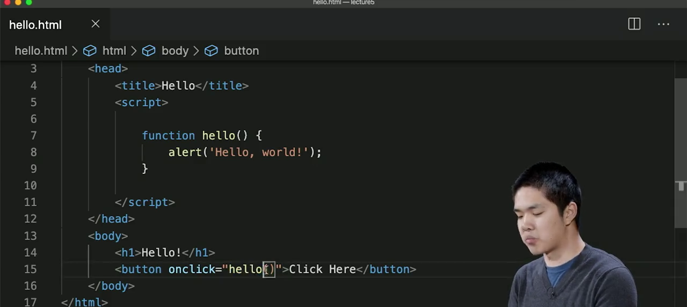


---

## 根据行号定位JS代码错误 [30:28-47:00]

### 时间线叙事

**[30:28-31:00] | 错误定位与分析**
- 浏览器控制台报错：`Uncaught TypeError: Cannot set property 'onclick' of null at counter.html:18`
- 错误信息明确指出问题来自`counter.html`文件的第18行，涉及尝试访问`null`的`onClick`属性
- `null`是JavaScript中表示“无”或“不存在对象”的特殊值
- 查看第18行代码：
```javascript
document.querySelector('button').onclick = count;
```
- 问题在于`document.querySelector('button')`返回了`null`，说明它未能找到页面中的`<button>`元素

**[31:00-32:10] | 问题根源：DOM加载顺序**
- 页面中确实存在一个`<button>`元素，位于第24行：
```html
<button>Count</button>
```
- 浏览器从上到下逐行执行代码，当执行到第18行JavaScript时，第24行的`<button>`元素尚未被解析和加载到DOM中
- JavaScript在寻找按钮时，DOM（文档对象模型）尚未完成加载，因此无法找到该元素
- 这是浏览器工作方式的一个特性：代码按顺序执行，脚本在遇到元素之前执行就会找不到元素

**[32:10-33:00] | 解决方案一：移动script标签**
- 第一种策略：将`<script>`标签移动到`<body>`底部，确保所有HTML元素先被定义
- 修改后的HTML结构：
```html
<body>
    <h1>0</h1>
    <button>Count</button>
    <script>
        document.querySelector('button').onclick = count;
    </script>
</body>
```
- 这样当JavaScript执行时，按钮已经存在于DOM中，可以成功找到

**[33:00-34:10] | 解决方案二：使用DOMContentLoaded事件**
- 更常见的做法是添加事件监听器到整个`document`对象
- `document`是JavaScript内置变量，代表整个网页文档
- 使用`document.addEventListener('DOMContentLoaded', callback)`监听DOM加载完成事件
- `DOMContentLoaded`事件在DOM结构完全加载后触发
- 语法结构：
```javascript
document.addEventListener('DOMContentLoaded', function() {
    // 当DOM加载完成后执行的代码
});
```
- `addEventListener`接受两个参数：第一个是事件名称，第二个是事件触发时要执行的函数

**[34:10-35:40] | 匿名函数的使用**
- 第二个参数可以直接传入一个匿名函数（没有名称的函数）
- 语法示例：
```javascript
document.addEventListener('DOMContentLoaded', function() {
    document.querySelector('button').onclick = count;
});
```
- 函数没有名称，因为不需要在其他地方引用它
- 函数体用花括号`{}`包裹，包含所有需要在DOM加载后执行的代码
- 这种语法在JavaScript中非常常见

**[35:40-36:40] | 事件监听器的两种写法**
- 可以使用`addEventListener`添加点击事件：
```javascript
document.querySelector('button').addEventListener('click', count);
```
- 也可以使用简写方式：
```javascript
document.querySelector('button').onclick = count;
```
- 两种方式效果相同，简写方式更简洁
- 使用`DOMContentLoaded`后，刷新页面，JavaScript错误消失，计数器正常工作

**[36:40-38:30] | 将JavaScript分离到独立文件**
- 类似于CSS可以分离到独立文件，JavaScript也可以这样做
- 创建新文件`counter.js`，将JavaScript代码移入：
```javascript
let counter = 0;

function count() {
    counter++;
    document.querySelector('h1').innerHTML = counter;
    if (counter % 10 === 0) {
        alert(`Count is now ${counter}`);
    }
}

document.addEventListener('DOMContentLoaded', function() {
    document.querySelector('button').onclick = count;
});
```
- 在HTML中使用`<script>`标签的`src`属性引用外部文件：
```html
<script src="counter.js"></script>
```
- 这样HTML文件变得更简洁，只包含结构和内容

**[38:30-39:30] | 分离JavaScript的好处**
- 多人协作时，不同人员可以分别处理HTML和JavaScript文件
- 如果JavaScript频繁更新而HTML不常变，可以单独加载JS文件
- 多个HTML页面可以共享同一个JavaScript文件，避免重复代码
- 可以方便地引入第三方JavaScript库（如Bootstrap的JS），只需添加`<script>`标签引用其源文件

**[39:30-41:00] | 表单交互示例**
- 创建更交互的页面：用户填写表单，JavaScript响应输入
- 回到`hello.html`，在`<body>`中添加表单：
```html
<body>
    <h1>Hello!</h1>
    <form>
        <input autofocus id="name" placeholder="Name" type="text">
        <input type="submit">
    </form>
</body>
```
- `placeholder="Name"`显示提示文本
- `id="name"`为输入字段提供唯一标识符，便于JavaScript定位

**[41:00-42:40] | 表单提交事件处理**
- 使用`DOMContentLoaded`确保DOM加载完成后执行代码
- 获取表单元素并设置`onsubmit`事件处理：
```javascript
document.addEventListener('DOMContentLoaded', function() {
    document.querySelector('form').onsubmit = function() {
        // 表单提交时要执行的代码
    };
});
```
- 使用匿名函数作为`onsubmit`属性的值
- 当用户提交表单时，该函数会被自动调用

**[42:40-44:50] | querySelector的选择器语法**
- `document.querySelector()`可以使用CSS选择器语法定位元素
- 三种主要选择方式：
  - 标签选择器：`document.querySelector('tag')` - 获取第一个匹配的标签元素
  - ID选择器：`document.querySelector('#id')` - 获取具有指定ID的元素
  - 类选择器：`document.querySelector('.class')` - 获取具有指定类的元素
- 与CSS选择器语法完全一致
- 当页面有多个相同标签时，使用ID或类选择器更精确

**[44:50-46:30] | 获取输入值并显示**
- 使用ID选择器获取输入字段：
```javascript
const name = document.querySelector('#name').value;
```
- `.value`属性获取用户在输入字段中实际输入的内容
- 使用`const`声明变量，因为不需要重新赋值
- 使用模板字符串显示问候语：
```javascript
alert(`Hello, ${name}!`);
```
- 反引号（`）包裹字符串，`${}`语法插入变量值

**[46:30-47:00] | 完整示例运行**
- 完整代码：
```javascript
document.addEventListener('DOMContentLoaded', function() {
    document.querySelector('form').onsubmit = function() {
        const name = document.querySelector('#name').value;
        alert(`Hello, ${name}!`);
    };
});
```
- 刷新页面后，在输入框中输入名字（如"Brian"），点击提交按钮
- 弹出警告框显示"Hello, Brian!"
- 再次输入其他名字（如"David"），提交后显示"Hello, David!"
- 成功实现了事件监听器、函数和querySelector的组合使用

### 要点总结

本章讲解了如何通过浏览器控制台的错误信息定位JavaScript代码问题，核心是理解DOM加载顺序导致的`null`引用错误。介绍了两种解决方案：将`<script>`标签移到`<body>`底部，或使用`DOMContentLoaded`事件确保DOM加载完成后再执行代码。同时学习了将JavaScript分离到独立文件的方法，以及使用`querySelector`配合CSS选择器语法定位元素、获取输入值并响应用户交互的完整流程。


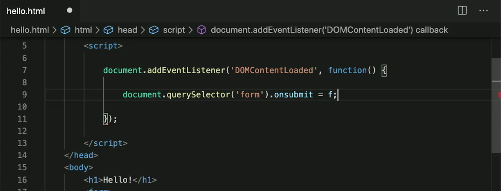


---

## 获取HTML元素用户输入内容 [47:00-59:49]

### 时间线叙事

**[47:00-47:38] | 回顾与引入：从获取用户输入到修改CSS样式**
- 回顾之前学习的内容：通过`document.querySelector('#name').value`获取用户在输入字段中输入的内容，结合事件监听器和`alert`实现动态响应。
- 指出除了修改HTML元素内容外，还可以修改CSS样式属性，即通过JavaScript改变元素的`style`属性。

**[47:38-48:27] | 创建示例页面：colors.html**
- 创建一个新文件`colors.html`，包含标准HTML模板。
- 在`<body>`中添加一个`<h1 id="hello">Hello!</h1>`标题，以及三个按钮：`<button>Red</button>`、`<button>Blue</button>`、`<button>Green</button>`。
- 在浏览器中打开该页面，显示大标题“Hello!”和三个按钮，但按钮目前没有功能。

**[48:27-49:16] | 添加JavaScript事件监听器并给按钮分配ID**
- 在页面中添加`<script>`标签，使用`document.addEventListener('DOMContentLoaded', function() { ... })`确保DOM加载完成后执行代码。
- 为每个按钮分配唯一ID以便在JavaScript中引用：
```html
<button id="red">Red</button>
<button id="blue">Blue</button>
<button id="green">Green</button>
```

**[49:16-50:36] | 为每个按钮编写点击事件处理函数**
- 使用`document.querySelector('#red').onclick = function() { ... }`为红色按钮添加点击事件。
- 在函数内部，通过`document.querySelector('#hello').style.color = 'red';`修改标题颜色。
- 使用双斜杠`//`添加注释，例如`// Change font color to red`。
- 为蓝色和绿色按钮编写类似代码：
```javascript
document.addEventListener('DOMContentLoaded', function() {
    // Change font color to red
    document.querySelector('#red').onclick = function() {
        document.querySelector('#hello').style.color = 'red';
    }
    // Change font color to blue
    document.querySelector('#blue').onclick = function() {
        document.querySelector('#hello').style.color = 'blue';
    }
    // Change font color to green
    document.querySelector('#green').onclick = function() {
        document.querySelector('#hello').style.color = 'green';
    }
});
```

**[50:36-51:45] | 演示效果**
- 刷新页面后，默认标题为黑色。
- 点击红色按钮，标题变为红色；点击蓝色按钮，标题变为蓝色；点击绿色按钮，标题变为绿色。
- 演示说明：点击按钮触发事件监听器，执行函数获取ID为`hello`的H1元素，修改其`style.color`属性。

**[51:45-52:29] | 代码重复问题与优化思路**
- 指出当前代码存在重复：为三个按钮编写了几乎相同的代码，这是不良设计。
- 提出优化方案：将三个事件监听器合并为一个函数，根据按钮的指示改变颜色。
- 核心问题：当点击按钮时，如何让按钮知道应该将文本改成什么颜色。

**[52:29-53:26] | 引入数据属性（data attributes）**
- 解决方案：为HTML元素添加自定义数据属性（data attributes）。
- 数据属性格式：以`data-`开头，后跟自定义名称，例如`data-color`。
- 为每个按钮添加数据属性：
```html
<button data-color="red">Red</button>
<button data-color="blue">Blue</button>
<button data-color="green">Green</button>
```
- 通过数据属性，可以在JavaScript中访问`button.dataset.color`来获取对应的颜色值。

**[53:26-54:31] | 使用querySelectorAll获取所有按钮**
- `document.querySelector`只返回第一个匹配元素。
- 使用`document.querySelectorAll`返回所有匹配元素的数组（NodeList）。
- 示例：`document.querySelectorAll('button')`返回包含三个按钮的NodeList。
- 在浏览器控制台中测试：
```javascript
document.querySelector('button')
// 返回第一个按钮：<button data-color="red">Red</button>

document.querySelectorAll('button')
// 返回NodeList(3)：[button, button, button]
```

**[54:31-56:11] | JavaScript数组基础**
- 在控制台中演示数组操作：
```javascript
const names = ["Harry", "Ron", "Hermione"];
names[0];  // "Harry"
names[1];  // "Ron"
names[2];  // "Hermione"
names.length;  // 3
```
- 数组索引从0开始，通过方括号`[]`访问元素，`length`属性获取数组长度。

**[56:11-57:24] | 使用forEach遍历按钮**
- `querySelectorAll`返回的NodeList支持`forEach`方法。
- `forEach`接受一个函数作为参数，该函数会对数组中的每个元素执行一次。
- 语法：`document.querySelectorAll('button').forEach(function(button) { ... })`
- 在遍历过程中，`button`参数代表当前正在处理的按钮元素。

**[57:24-59:49] | 完整优化后的代码实现**
- 在`forEach`回调函数中，为每个按钮添加点击事件处理：
```javascript
document.addEventListener('DOMContentLoaded', function() {
    document.querySelectorAll('button').forEach(function(button) {
        button.onclick = function() {
            document.querySelector('#hello').style.color = button.dataset.color;
        };
    });
});
```
- 代码执行流程：
  1. 页面加载完成后，`DOMContentLoaded`事件触发。
  2. `document.querySelectorAll('button')`获取所有按钮。
  3. `forEach`遍历每个按钮，为每个按钮添加`onclick`事件处理函数。
  4. 当按钮被点击时，获取ID为`hello`的元素，将其颜色设置为`button.dataset.color`（即按钮的`data-color`属性值）。
- 通过数据属性，每个按钮携带自己的颜色信息，无需为每个按钮单独编写事件处理代码，实现了代码复用。

### 要点总结

本章演示了如何通过JavaScript获取HTML元素并修改其CSS样式属性，重点介绍了使用`querySelectorAll`和`forEach`遍历多个元素，以及通过HTML数据属性（data attributes）为元素附加自定义数据，实现更高效、可维护的代码。核心学习目标包括：理解`style`属性修改CSS的方法、掌握`querySelectorAll`与`querySelector`的区别、学会使用`forEach`遍历NodeList、以及运用数据属性存储和访问元素相关信息。

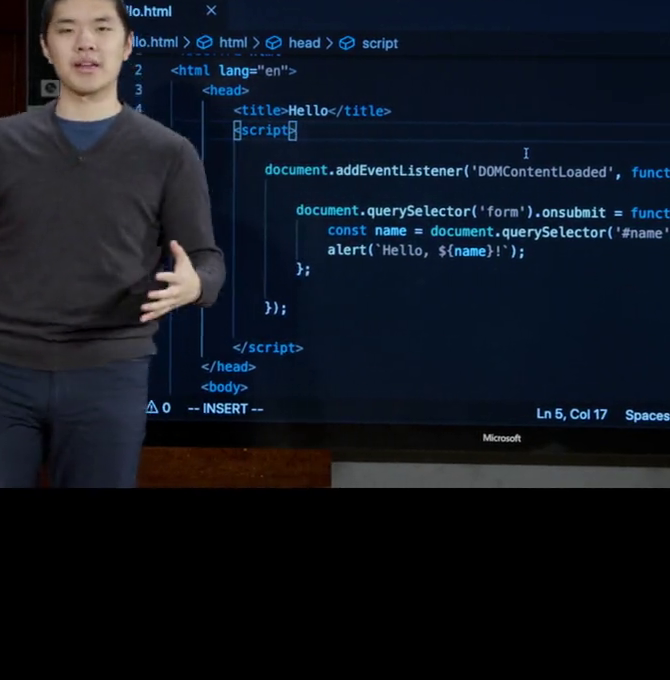
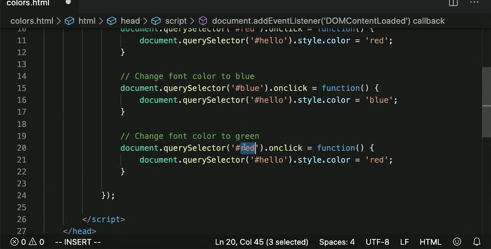
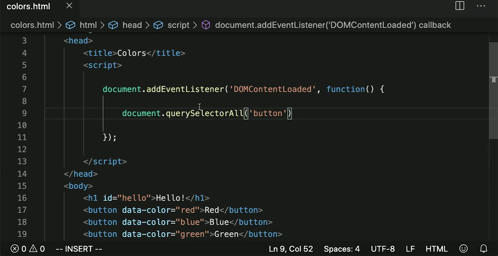


---

## 讲解dataset数据属性使用方法 [59:49-91:49]

### 时间线叙事

**[59:49-60:17] | 使用dataset属性简化事件处理**
- 背景：之前为每个颜色按钮（红、蓝、绿）分别编写了独立的事件处理函数，代码冗余。
- 目的：通过HTML的`data-*`属性和JavaScript的`dataset`对象，将三个事件处理函数合并为一个通用函数。
- 具体实现：在HTML按钮上添加`data-color`属性，JavaScript中通过`button.dataset.color`获取对应颜色值，并设置`#hello`元素的文本颜色。
- 代码示例：
```html
<button data-color="red">Red</button>
<button data-color="blue">Blue</button>
<button data-color="green">Green</button>
```
```javascript
document.addEventListener('DOMContentLoaded', function() {
    document.querySelectorAll('button').forEach(function(button) {
        button.onclick = function() {
            document.querySelector('#hello').style.color = button.dataset.color;
        }
    });
});
```
- 效果：无论点击哪个按钮，都能正确改变颜色，代码量大幅减少。

**[60:17-61:21] | 使用JavaScript控制台调试**
- 背景：开发者需要理解代码运行时的变量状态和DOM元素选择结果。
- 目的：演示如何利用浏览器JavaScript控制台进行实时调试和变量修改。
- 具体操作：
  - 打开控制台（F12），直接输入`counter = 27`修改变量值。
  - 页面不会立即更新，但下次触发`count`函数时，会基于修改后的值（27）递增到28。
  - 使用`document.querySelector`测试选择器返回的元素。
- 结论：控制台是调试程序、验证变量值和选择器结果的有力工具。

**[61:21-62:29] | 箭头函数语法**
- 背景：ES6引入了更简洁的函数定义方式。
- 目的：介绍箭头函数（Arrow Function）作为传统`function`关键字的简写形式。
- 语法规则：
  - 无参数：`() => { ... }`
  - 单参数：`button => { ... }`（可省略括号）
  - 多参数：`(a, b) => { ... }`
- 示例对比：
```javascript
// 传统写法
document.querySelectorAll('button').forEach(function(button) { ... });

// 箭头函数写法
document.querySelectorAll('button').forEach(button => { ... });
```
- 说明：箭头左侧是输入参数，右侧是函数体代码。

**[62:29-65:46] | 使用下拉菜单（select）替代按钮**
- 背景：当选项较多时，按钮组不如下拉菜单简洁。
- 目的：将颜色选择器从三个按钮改为一个`<select>`下拉菜单，并学习`onchange`事件和`this`关键字。
- HTML结构：
```html
<select>
    <option value="black">Black</option>
    <option value="red">Red</option>
    <option value="blue">Blue</option>
    <option value="green">Green</option>
</select>
```
- JavaScript实现：
```javascript
document.addEventListener('DOMContentLoaded', () => {
    document.querySelector('select').onchange = function() {
        document.querySelector('#hello').style.color = this.value;
    }
});
```
- 关键概念：
  - `onchange`事件：当下拉菜单选项改变时触发。
  - `this`关键字：在事件处理函数中，`this`指向触发事件的元素（即`<select>`）。
  - `this.value`：获取当前选中选项的`value`属性值。
- 效果：用户选择不同颜色，标题文字颜色实时变化。

**[65:46-66:29] | 常见事件类型概览**
- 背景：JavaScript支持多种用户交互事件。
- 目的：列举常用事件类型，为后续构建复杂应用做准备。
- 事件列表：
  - `onclick`：鼠标点击
  - `onmouseover`：鼠标悬停
  - `onkeydown`：键盘按键按下
  - `onkeyup`：键盘按键释放
  - `onload`：页面/元素加载完成
  - `onblur`：元素失去焦点
- 说明：开发者可以监听这些事件并编写响应函数，实现丰富的用户交互。

**[66:29-68:08] | 构建待办事项列表应用（HTML结构）**
- 背景：开始构建一个纯JavaScript的待办事项列表应用。
- 目的：搭建HTML骨架，包含标题、任务列表容器和表单。
- HTML代码：
```html
<!DOCTYPE html>
<html lang="en">
<head>
    <title>Tasks</title>
</head>
<body>
    <h1>Tasks</h1>
    <ul id="tasks"></ul>
    <form>
        <input id="task" placeholder="New Task" type="text">
        <input type="submit">
    </form>
</body>
</html>
```
- 说明：`<ul id="tasks">`用于动态显示任务列表，表单用于输入和提交新任务。

**[68:08-70:03] | 表单提交事件处理与console.log调试**
- 背景：需要捕获表单提交事件，获取用户输入的任务内容。
- 目的：添加事件监听器，阻止表单默认提交行为，并输出输入值到控制台。
- JavaScript代码：
```javascript
document.addEventListener('DOMContentLoaded', function() {
    document.querySelector('form').onsubmit = () => {
        const task = document.querySelector('#task').value;
        console.log(task);
        // Stop form from submitting
        return false;
    }
});
```
- 关键点：
  - `document.querySelector('#task').value`：获取输入框的当前值。
  - `console.log(task)`：将任务内容输出到控制台，用于调试。
  - `return false`：阻止表单的默认提交行为（页面刷新），实现客户端处理。

**[70:03-72:19] | 动态创建和添加DOM元素**
- 背景：仅打印到控制台不够，需要将任务实际显示在页面上。
- 目的：使用`document.createElement`创建新列表项，并通过`appendChild`添加到DOM中。
- 代码实现：
```javascript
document.addEventListener('DOMContentLoaded', function() {
    document.querySelector('form').onsubmit = () => {
        const task = document.querySelector('#task').value;
        const li = document.createElement('li');
        li.innerHTML = task;
        document.querySelector('#tasks').appendChild(li);
        // Stop form from submitting
        return false;
    }
});
```
- 步骤说明：
  1. `document.createElement('li')`：创建一个新的`<li>`元素。
  2. `li.innerHTML = task`：将用户输入的任务文本设置为列表项的内容。
  3. `document.querySelector('#tasks').appendChild(li)`：将新列表项添加到`<ul id="tasks">`的末尾。
- 效果：提交表单后，新任务立即出现在页面上。

**[72:19-73:20] | 清空输入框**
- 背景：提交任务后，输入框仍保留上次输入的内容，用户体验不佳。
- 目的：提交后自动清空输入框。
- 代码修改：
```javascript
document.querySelector('#task').value = '';
```
- 完整代码片段：
```javascript
document.querySelector('form').onsubmit = () => {
    const task = document.querySelector('#task').value;
    const li = document.createElement('li');
    li.innerHTML = task;
    document.querySelector('#tasks').appendChild(li);
    document.querySelector('#task').value = '';
    return false;
}
```
- 效果：提交任务后，输入框立即变为空，方便输入下一个任务。

**[73:20-75:00] | 禁用提交按钮（初始状态）**
- 背景：用户可能提交空字符串，导致出现空列表项。
- 目的：默认禁用提交按钮，防止空提交。
- 操作步骤：
  1. 给提交按钮添加`id`属性：`<input id="submit" type="submit">`
  2. JavaScript中设置初始禁用状态：
```javascript
document.addEventListener('DOMContentLoaded', function() {
    document.querySelector('#submit').disabled = true;
    // ... 其他代码
});
```
- 效果：页面加载后，提交按钮为灰色不可点击状态。

**[75:00-76:39] | 根据输入启用提交按钮（onkeyup事件）**
- 背景：用户开始输入时，应启用提交按钮。
- 目的：监听键盘按键释放事件（`onkeyup`），当输入框有内容时启用按钮。
- 代码实现：
```javascript
document.querySelector('#task').onkeyup = () => {
    document.querySelector('#submit').disabled = false;
};
```
- 效果：只要用户在输入框中按下并释放任意键，提交按钮立即变为可用状态。

**[76:39-77:06] | 提交后重新禁用按钮**
- 背景：提交任务后，按钮应再次变为禁用状态。
- 目的：在表单提交处理函数末尾，重新设置按钮为禁用。
- 代码修改：
```javascript
document.querySelector('form').onsubmit = () => {
    const task = document.querySelector('#task').value;
    const li = document.createElement('li');
    li.innerHTML = task;
    document.querySelector('#tasks').appendChild(li);
    document.querySelector('#task').value = '';
    document.querySelector('#submit').disabled = true;
    return false;
};
```
- 效果：提交后按钮立即变灰，直到用户再次输入。

**[77:06-78:33] | 条件判断优化：输入为空时禁用按钮**
- 背景：用户输入内容后全部删除，按钮仍保持启用状态，仍可提交空任务。
- 目的：在`onkeyup`事件中添加条件判断，仅当输入框长度大于0时才启用按钮。
- 优化代码：
```javascript
document.querySelector('#task').onkeyup = () => {
    if (document.querySelector('#task').value.length > 0) {
        document.querySelector('#submit').disabled = false;
    } else {
        document.querySelector('#submit').disabled = true;
    }
};
```
- 效果：输入框有内容时按钮启用，内容为空时按钮禁用，彻底防止空提交。

**[78:33-79:10] | JavaScript交互能力总结**
- 背景：通过待办事项列表应用，展示了JavaScript的多种交互能力。
- 总结能力：
  - 响应用户输入（键盘事件）
  - 动态添加DOM元素（`createElement`、`appendChild`）
  - 修改元素样式和属性（`style.color`、`disabled`）
- 结论：JavaScript使页面从静态变为动态交互式应用。

**[79:10-80:47] | 使用setInterval实现自动计数**
- 背景：之前计数器需要手动点击按钮递增。
- 目的：使用`setInterval`让计数器每秒自动递增，无需用户操作。
- 代码实现：
```javascript
let counter = 0;
function count() {
    counter++;
    document.querySelector('h1').innerHTML = counter;
}
document.addEventListener('DOMContentLoaded', function() {
    document.querySelector('button').onclick = count;
    setInterval(count, 1000);
});
```
- 说明：
  - `setInterval(count, 1000)`：每1000毫秒（1秒）执行一次`count`函数。
  - 手动点击按钮仍可触发`count`，与自动计时器并行工作。
- 应用场景：倒计时器、实时时钟等需要周期性更新的功能。

**[80:47-82:38] | 引入localStorage实现数据持久化**
- 背景：刷新页面后，计数器重置为0，状态丢失。
- 目的：使用`localStorage`在浏览器中存储数据，实现跨页面访问的状态保持。
- 核心API：
  - `localStorage.getItem(key)`：根据键名获取存储的值。
  - `localStorage.setItem(key, value)`：设置键值对存储。
- 说明：`localStorage`将数据保存在用户浏览器中，即使关闭页面再打开，数据仍然存在。

**[82:38-84:41] | 使用localStorage改造计数器**
- 背景：需要让计数器记住上次的数值。
- 目的：在页面加载时从`localStorage`读取计数器值，每次递增后更新存储。
- 改造后的代码：
```javascript
if (!localStorage.getItem('counter')) {
    localStorage.setItem('counter', 0);
}

function count() {
    let counter = localStorage.getItem('counter');
    counter++;
    document.querySelector('h1').innerHTML = counter;
    localStorage.setItem('counter', counter);
}

document.addEventListener('DOMContentLoaded', function() {
    document.querySelector('button').onclick = count;
});
```
- 关键逻辑：
  1. 首次加载时，若`localStorage`中没有`counter`键，则初始化为0。
  2. 每次点击按钮，从`localStorage`获取当前值，递增后更新页面和存储。
- 问题：刷新页面后显示0，但点击按钮后数值正确（因为页面初始显示硬编码的0）。

**[84:41-86:53] | 修复页面加载时的显示问题**
- 背景：页面加载时`<h1>`显示硬编码的0，与实际存储值不一致。
- 目的：在DOM加载完成后，立即从`localStorage`读取值并更新页面显示。
- 修复代码：
```javascript
document.addEventListener('DOMContentLoaded', function() {
    document.querySelector('h1').innerHTML = localStorage.getItem('counter');
    document.querySelector('button').onclick = count;
});
```
- 效果：刷新页面后，`<h1>`直接显示`localStorage`中存储的数值（如28），不再显示0。
- 验证：在Chrome开发者工具的Application > Local Storage中可看到`counter`键及其值。

**[86:53-88:09] | JavaScript数据类型回顾**
- 背景：本章学习了多种JavaScript数据类型。
- 目的：总结已接触的数据类型，为引入对象类型做铺垫。
- 数据类型列表：
  - 整数（如计数器值）
  - 字符串（如任务文本）
  - HTML元素（通过`querySelector`获取）
  - 数组（如`querySelectorAll`返回的NodeList）
  - 函数（可赋值给变量）
- 说明：JavaScript中函数是一等公民，可以像其他值一样赋值和传递。

**[88:09-89:30] | JavaScript对象（Object）**
- 背景：对象是JavaScript中最有用的数据类型之一。
- 目的：演示对象的创建和属性访问，类比Python字典。
- 创建对象：
```javascript
let person = {
    first: 'Harry',
    last: 'Potter'
};
```
- 属性访问方式：
  - 点号法：`person.first` → `"Harry"`
  - 方括号法：`person['first']` → `"Harry"`
- 说明：对象是键值对的集合，键称为属性（property），值可以是任意数据类型。

**[89:30-91:49] | 引入API和JSON**
- 背景：对象在数据交换中非常有用。
- 目的：介绍API（应用程序编程接口）和JSON（JavaScript对象表示法）的概念。
- 核心概念：
  - API：服务间通信的标准化方式，通过发送请求和接收结构化数据实现。
  - JSON：基于JavaScript对象语法的轻量级数据交换格式，人类可读且机器可解析。
- JSON示例（表示航班信息）：
```json
{
    "origin": "New York",
    "destination": "London",
    "duration": 415
}
```
- 说明：JSON要求键名必须用双引号包裹，而JavaScript对象中键名可以省略引号。
- 应用场景：Web应用通过API获取天气、地图等外部服务的数据，数据格式通常为JSON。

### 要点总结

1. 通过`dataset`属性和箭头函数简化事件处理，将多个相似事件处理函数合并为一个通用函数。
2. 掌握表单事件处理、DOM元素动态创建与添加、输入框清空等核心交互技术，构建了完整的待办事项列表应用。
3. 利用`onkeyup`事件和条件判断实现提交按钮的智能启用/禁用，提升用户体验。
4. 使用`setInterval`实现周期性函数调用，并通过`localStorage`实现浏览器端数据持久化，使计数器状态跨页面刷新保持。
5. 理解JavaScript对象的基本语法，并了解JSON作为数据交换格式在API通信中的重要作用。

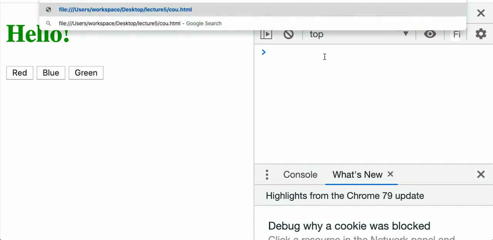
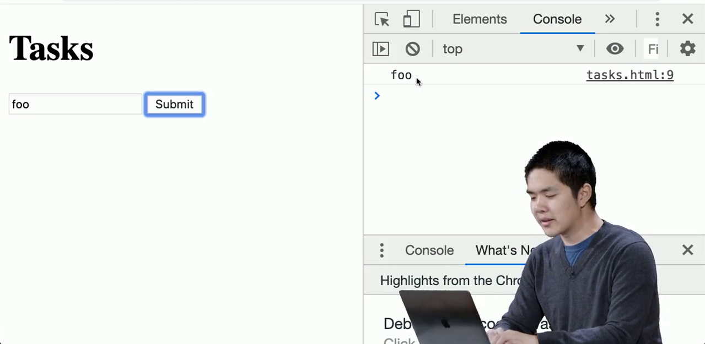
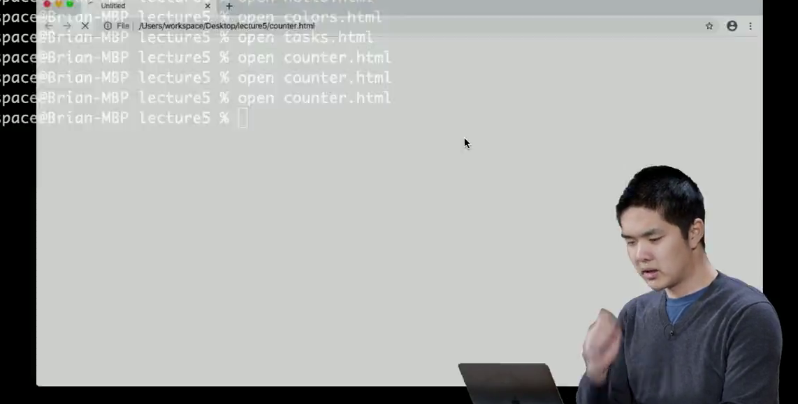


---

## 讲解JSON与JS对象语法异同 [91:49-95:31]

### 时间线叙事

**[91:49-92:12] | JSON与JS对象语法对比**
- 讲解者指出，在JavaScript对象中，键名可以不加引号，例如可以直接写`origin: "New York"`，而不必写成`"origin": "New York"`。但JSON（JavaScript Object Notation）要求键名必须用双引号包裹，这是两者语法的关键区别。
- JSON语法与JavaScript对象语法非常相似，JavaScript能够直接解析JSON数据并将其转换为JavaScript对象。其他编程语言如Python也具备解析JSON数据的能力，这使得JSON成为一种跨语言的数据交换格式。
- 屏幕上展示了一个基本的JSON对象示例：
```json
{
  "origin": "New York",
  "destination": "London",
  "duration": 415
}
```

**[92:13-92:52] | JSON支持嵌套结构**
- JSON的一大优势是能够表示复杂的数据结构。值不仅可以是字符串或数字，还可以是数组（列表）或嵌套的JavaScript对象。
- 讲解者以航班信息为例，说明如何将简单的字符串值扩展为嵌套对象：将`origin`从字符串`"New York"`改为一个包含`city`和`code`属性的对象，同时`destination`也做同样处理。
- 屏幕上展示了嵌套结构的JSON示例：
```json
{
  "origin": {
    "city": "New York",
    "code": "JFK"
  },
  "destination": {
    "city": "London",
    "code": "LHR"
  },
  "duration": 415
}
```

**[92:53-93:27] | JSON数据交换的约定与API概念**
- 讲解者强调，JSON数据交换的关键在于通信双方必须事先约定好数据结构——包括键的名称、值的类型以及整体结构。接收方根据约定编写程序来解析和使用这些数据。
- 引入API（应用程序编程接口）的概念：在线服务通过API提供数据，这些数据通常以JSON格式返回，便于机器读取和处理。
- 以货币汇率为例说明：汇率实时变化，通过调用在线汇率API获取JSON格式的最新数据，可以开发实时货币兑换应用。

**[93:28-94:13] | 货币汇率API返回的JSON数据结构**
- 讲解者展示了一个典型的汇率API返回的JSON对象结构：包含`base`键（表示基准货币）和`rates`键（包含各种货币的汇率）。
- 屏幕上展示了示例数据：
```json
{
  "rates": {
    "EUR": 0.907,
    "JPY": 109.716,
    "GBP": 0.766,
    "AUD": 1.479
  },
  "base": "USD"
}
```
- 该结构表示以美元（USD）为基准，兑换欧元（EUR）、日元（JPY）、英镑（GBP）和澳元（AUD）的汇率。讲解者指出，这种结构并非唯一标准，但是一种方便且常用的组织方式。

**[94:14-94:46] | 实际调用汇率API**
- 讲解者演示了如何实际调用汇率API：访问`https://api.exchangeratesapi.io/latest?base=USD`，通过GET参数`base=USD`指定基准货币为美元。
- 屏幕上展示了浏览器地址栏中输入该URL的过程，以及返回的原始JSON数据。返回的数据虽然看起来杂乱（没有格式化缩进），但结构与之前展示的示例完全相同。

**[94:47-95:31] | 解析实际返回的JSON数据**
- 屏幕上展示了API实际返回的JSON数据片段，包含大量货币汇率：
```json
{"rates": {
"CAD":1.327819685,"HKD":7.7633372717,"ISK":125.5112242116,
"PHP":50.7288921203,"DKK":6.7913296374,"HUF":306.0619830955,
"CZK":22.6238298646,"GBP":0.7710169954,"RON":4.3310915205,
"SEK":9.5928383168,"IDR":13633.3818049623,"INR":71.1483231846,
"BRL":4.2309370172,"RUB":63.1259656457,"HRK":6.7766063801,
"JPY":109.851858584,"THB":31.0797055349,"CHF":0.9738253204,
"EUR":0.9088430428,"MYR":4.1215123148,"BGN":1.7775152231,
"TRY":5.9880032718,"CNY":6.968644915,"NOK":9.205489412,"NZD":1.5444878669,
"ZAR":14.8166863583,"USD":1.0,"MXN":18.6178315005,"SGD":1.3844406071,
"AUD":1.4797782423,"ILS":3.4327001727,"KRW":1183.1136962647,
"PLN":3.858129601}, "base": "USD", "date": "2020-02-06"}}
```
- 数据中包含`base`键（值为"USD"）、`date`键（值为"2020-02-06"）以及`rates`对象，其中包含数十种货币对美元的汇率。讲解者指出，只需通过HTTP请求访问该URL，即可获取这些实时汇率数据，并在应用程序中使用。

### 要点总结

本章对比了JSON与JavaScript对象语法的异同，重点讲解了JSON要求键名必须用双引号包裹而JS对象可以省略。通过嵌套结构示例展示了JSON表示复杂数据的能力，并引入API概念，以货币汇率API为例演示了如何通过HTTP请求获取JSON格式的实时数据，为后续开发数据驱动的应用奠定基础。

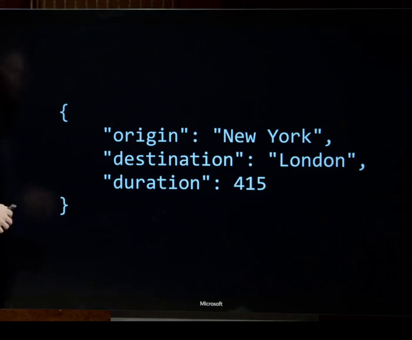
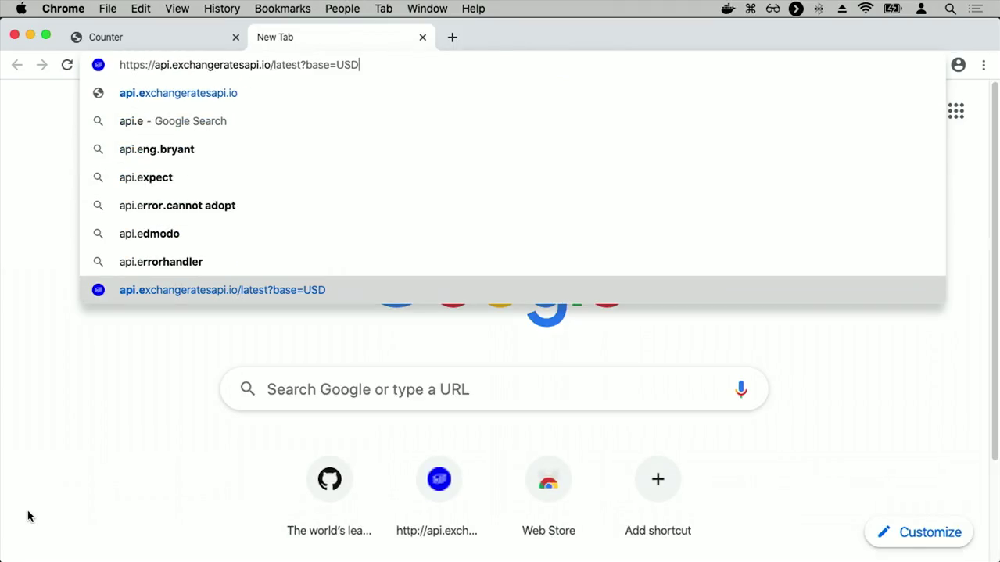
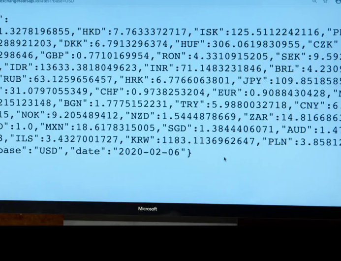


---

## 搭建货币兑换页面基础结构 [95:31-105:35]

### 时间线叙事

**[95:31-95:54] | 创建基础HTML文件**
- 创建一个名为`currency.html`的新文件
- 添加标准HTML结构，设置标题为"Currency Exchange"，`<body>`标签内暂时为空
- 核心目标是编写JavaScript代码，通过Web请求获取外部数据

**[95:55-96:28] | 引入Ajax概念**
- 回顾：此前所有JavaScript代码仅在本地浏览器中运行，未与外部服务器通信
- 引入Ajax（异步JavaScript）概念：页面加载后，仍可通过JavaScript发起额外的Web请求，从自己的服务器或第三方服务器获取更多信息
- 本案例目标：页面发起异步请求，获取当前货币汇率数据

**[96:29-97:31] | 使用fetch函数发起请求**
- 在`DOMContentLoaded`事件后执行代码
- 使用现代JavaScript内置的`fetch`函数发起Web请求
- 请求的URL为：`https://api.exchangeratesapi.io/latest?base=USD`
- 该URL通过查询参数`base=USD`指定以美元为基础货币
- 了解API工作方式需阅读其文档，了解URL参数和返回数据结构

**[97:32-98:50] | 处理Promise与响应转换**
- `fetch`返回一个JavaScript Promise对象，表示未来会返回结果但不一定立即返回
- 使用`.then()`方法处理Promise：当请求返回响应时执行回调
- 在第一个`.then()`中，将响应转换为JSON格式：`.then(response => response.json())`
- 使用箭头函数简写：省略花括号和return关键字，直接写`response => response.json()`
- 第二个`.then()`接收转换后的JSON数据，目前仅用`console.log(data)`打印到控制台

**[98:51-99:45] | 简化箭头函数语法**
- 对于仅做输入输出转换的简单函数，可进一步简化
- 省略花括号和return，直接写`response => response.json()`
- 完整代码结构：
```javascript
document.addEventListener('DOMContentLoaded', function() {
    fetch('https://api.exchangeratesapi.io/latest?base=USD')
        .then(response => response.json())
        .then(data => {
            console.log(data);
        });
});
```

**[99:46-100:15] | 查看返回数据**
- 打开`currency.html`，页面为空白
- 在JavaScript检查器中查看控制台输出，看到返回的JavaScript对象
- 展开对象后，看到包含多种货币的汇率数据，例如1美元兑换其他货币的比率

**[100:16-101:13] | 提取特定汇率数据**
- 返回的数据结构：一个JavaScript对象，包含`rates`键，其值为嵌套对象
- 在`rates`对象中，可通过货币代码（如`EUR`）访问对应汇率
- 代码实现：`const rate = data.rates.EUR;` 获取美元兑欧元汇率

**[101:14-101:56] | 将汇率显示到页面**
- 使用`document.querySelector('body').innerHTML = rate;`将汇率值写入页面
- 刷新页面后，显示类似`0.908843`的数字，表示1美元约等于0.91欧元
- 使用模板字符串使显示更友好：`` `1 US dollar is equal to ${rate} euros` ``

**[101:57-102:25] | 格式化数字显示**
- 默认显示过多小数位，使用`.toFixed()`方法保留三位小数
- 代码：`rate.toFixed(3)`，将汇率四舍五入到三位小数
- 最终显示："1 US dollar is equal to 0.909 euros"

**[102:26-102:49] | 理解异步请求流程**
- 整个过程是异步的：请求最新汇率数据，收到数据后JavaScript将其插入页面
- 实现了与API通信：获取JSON格式数据，并用其更新HTML页面内容

**[102:50-103:46] | 添加用户交互表单**
- 为让用户选择兑换货币，在`<body>`中添加表单
- 添加输入框：`<input id="currency" placeholder="Currency" type="text">`
- 添加提交按钮：`<input type="submit" value="Convert">`
- 添加结果显示区域：`<div id="result"></div>`

**[103:47-104:11] | 绑定表单提交事件**
- 不再立即执行fetch，改为在表单提交时触发
- 获取表单元素：`document.querySelector('form')`
- 设置`onsubmit`事件处理函数，并在函数末尾`return false`阻止表单实际提交
- 在事件处理函数中执行fetch请求

**[104:12-105:35] | 动态获取用户输入的货币**
- 在fetch的`.then()`回调中，获取用户输入：`const currency = document.querySelector('#currency').value;`
- 使用变量访问对应汇率：`data.rates[currency]`（使用方括号语法，因为货币代码是变量）
- 完整代码结构：
```javascript
document.addEventListener('DOMContentLoaded', function() {
    document.querySelector('form').onsubmit = function() {
        fetch('https://api.exchangeratesapi.io/latest?base=USD')
            .then(response => response.json())
            .then(data => {
                const currency = document.querySelector('#currency').value;
                const rate = data.rates[currency];
                document.querySelector('body').innerHTML = `1 USD is equal to ${rate} ${currency}`;
            });
        return false;
    };
});
```

### 要点总结

本章介绍了如何使用JavaScript的`fetch`函数发起异步HTTP请求，从外部API获取实时货币汇率数据。通过处理Promise对象和链式调用`.then()`方法，将响应数据转换为JSON格式并提取所需信息。最终构建了一个交互式货币兑换页面，允许用户输入目标货币代码，动态显示美元与该货币的实时汇率。


---

## 验证用户输入货币的合法性 [105:35-111:23]

### 时间线叙事

**[105:35-106:15] | 理解 undefined 与对象属性访问**
- 讲解者提出核心问题：用户输入的货币要么是有效的，要么是无效的
- 解释 JavaScript 中访问不存在的对象属性会返回 `undefined`
- 通过示例演示：`let person = {first: 'Harry', last: 'Potter'};`，访问 `person.first` 返回 `"Harry"`，`person.last` 返回 `"Potter"`，但访问 `person.middle` 返回 `undefined`
- 指出 `undefined` 与 `null` 含义相似但使用场景略有不同

**[106:16-107:04] | 实现货币合法性验证逻辑**
- 在代码中添加条件判断：`if (rate !== undefined)`，如果汇率存在则更新结果
- 更新结果显示为：`1 USD is equal to ${rate}`，其中货币名称动态显示
- 添加 `else` 分支：`document.querySelector('#result').innerHTML = 'Invalid currency.';`
- 完整代码逻辑：
```javascript
.then(data => {
    const currency = document.querySelector('#currency').value;
    const rate = data.rates[currency];
    if (rate !== undefined) {
        document.querySelector('#result').innerHTML = `1 USD is equal to ${rate.toFixed(2)}`;
    } else {
        document.querySelector('#result').innerHTML = 'Invalid currency.';
    }
});
```

**[107:05-107:58] | 功能演示与验证**
- 打开 `currency.html` 页面，输入 `EUR` 点击 Convert，显示 `1 USD equal to 0.909 euros`
- 输入 `GBP` 点击 Convert，显示 `1 USD equal to 0.771 pounds`
- 输入 `JPY` 点击 Convert，显示 `1 USD equal to 109.852 Japanese yen`
- 每次提交表单都会重新发起 API 请求，获取最新汇率
- 输入无效货币 `foo` 点击 Convert，页面显示 `Invalid currency.`
- 输入 `USD` 自身，显示 `1 USD is equal to 1 USD`

**[107:59-109:08] | 优化：处理大小写问题**
- 发现输入小写 `eur` 会被判定为无效货币
- 检查 API 返回数据，发现所有货币代码均为大写字母（如 `CAD`、`HKD`、`EUR` 等）
- 解决方案：在获取用户输入后调用 `.toUpperCase()` 方法
- 修改代码：
```javascript
const currency = document.querySelector('#currency').value.toUpperCase();
const rate = data.rates[currency];
```
- 演示效果：输入小写 `euro` 后仍能正确转换

**[109:09-110:15] | 添加错误处理机制**
- 指出网络请求可能失败（API 宕机、变更等不可预测情况）
- 在 Promise 链末尾添加 `.catch()` 方法处理错误
- 完整代码结构：
```javascript
fetch('https://api.exchangeratesapi.io/latest?base=USD')
.then(response => response.json())
.then(data => {
    const currency = document.querySelector('#currency').value.toUpperCase();
    const rate = data.rates[currency];
    if (rate !== undefined) {
        document.querySelector('#result').innerHTML = `1 USD is equal to ${rate.toFixed(2)}`;
    } else {
        document.querySelector('#result').innerHTML = 'Invalid currency.';
    }
})
.catch(error => {
    console.log('Error:', error);
});
```
- 错误处理确保程序崩溃时能通过控制台查看具体错误信息

**[110:16-111:23] | 总结与展望**
- 总结已实现功能：一个能与外部 API 通信、获取信息并更新页面的完整网页
- 强调 JavaScript 的核心能力：客户端代码执行、DOM 操作、事件处理
- 通过事件监听器（点击、滚动、按键）实现交互式网页
- 预告下一节将继续深入 JavaScript，构建更有趣的用户界面

### 要点总结

本章实现了用户输入货币的合法性验证，通过检查 API 返回数据中是否存在对应货币代码（返回 `undefined` 则无效），并添加了大小写转换（`.toUpperCase()`）和错误处理（`.catch()`）机制。最终构建了一个完整的货币兑换网页，能够动态获取实时汇率并反馈给用户。

